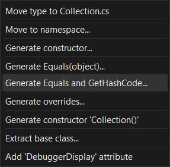

# C#


## .NET Core

- Cross-Platform
- Open Source
- High Performance

## .NET Framework

- Windows Only
- Not fully Open Source

## Tools

[Mono Cecil](https://github.com/jbevain/cecil)

- Load existing managed assemblies, browse and inspect all the types, modify on the fly and save back the modified assembly.

[ILSpy](https://github.com/icsharpcode/ILSpy)

- .NET Decompiler

[dnSpy](https://github.com/dnSpy/dnSpy)

- .NET Debugger
- .NET Decompiler
- .NET Assembly editor

[BepInEx](https://github.com/BepInEx/BepInEx)

- For Unity
- Included HarmonyX

## NameSpace

```c#
// 命名空間，用來組織/分隔命名，如果有很多 class，別人寫的 class 名稱也可能和你的 class 一樣，可以防止名稱 conflict

namespace NameSpace
{
    // ...
}
```

直接使用 <namespace> 命名空間裡的類
```c#
using System;
Console.WriteLine("Hello, World!");
// same as
System.Console.WriteLine("Hello, World!");
```

用 Generic (Alias) 來存取 System.Collections.Generic 命名空間
```c#
using Generic = System.Collections.Generic;
new Generic::Dictionary<string, int>();
```

全域命名空間 (Global / Top Level Name Space)

```c#
global::
```

巢狀

```c#
// N1
namespace N1
{
    // N1.C1
    class C1
    {
        // N1.C1.C2
        class C2
        {
        }
    }
    // N1.N2
    namespace N2
    {
        // N1.N2.C2
        class C2
        {
        }
    }
}
```

## `typeof` / `GetType()` / `is`

> [Reference](https://docs.microsoft.com/en-us/dotnet/csharp/language-reference/operators/type-testing-and-cast#cast-expression)

```c#
public class Animal { }

public class Cat : Animal { }

public static class TypeOfExample
{
    public static void Main()
    {
        object cat = new Cat();
        Console.WriteLine(cat is Animal);  // True
        Console.WriteLine(cat.GetType() == typeof(Animal));  // False

        Console.WriteLine(cat is Cat);  // True
        Console.WriteLine(cat.GetType() == typeof(Cat));  // True
    }
}
```

## `as` / Cast

> [Reference](https://docs.microsoft.com/en-us/dotnet/csharp/language-reference/operators/type-testing-and-cast#cast-expression)

```c#
// Cast, convert E to type T
(T) E

E as T
// same as
E is T ? (T)(E) : (T)null
```

- `E` is an expression that returns a value
- `T` is the name of a type or a type parameter

## String format

```c#
string.format("{0} is a {1}", "Cat", "animal");
// Cat is a animal

var a = "Cat";
var b = "animal";
$"{a} is a {b}";
// Cat is a animal
```

## Use `object` as `Dictionary` key

> [Reference](https://docs.microsoft.com/en-us/dotnet/csharp/programming-guide/statements-expressions-operators/how-to-define-value-equality-for-a-type)

```c#
public class DictKey
{
    public int key;

    public override int GetHashCode()
    {
        return this.key;
    }

    public override bool Equals(object obj)
    {
        return (obj is DictKey dictKey) &&
            return this.key == dictKey.key;
    }
}
```

Visual Studio has **Quick Action** to **Generate Equals and GetHashCode**

> [Reference](https://docs.microsoft.com/en-us/visualstudio/ide/reference/generate-equals-gethashcode-methods?view=vs-2019)



## Implement `GetHashCode()`

```c#
// .NET Core
HashCode.Combine(value, ...);
```

For Collection

```c#
public class Hash
{
    public List<int> list;

    public override int GetHashCode()
    {
        var hashCode = new HashCode();
        foreach (var item in list)
        {
            hashCode.Add(item);
        }
        return hashCode.ToHashCode();
    }
}
```

## `?.` / `?[]` Null-conditional operator

> [Reference](https://docs.microsoft.com/en-us/dotnet/csharp/language-reference/operators/member-access-operators#null-conditional-operators--and-)

```c#
a?.x
```

If a is null, the result is null, otherwise the result is a.x

```c#
a?.x()
a?.b?.c(d);
a?.b?[c];
```

If a is null, the result is null, and will not execute a.x(), otherwise the result is a.x()

> The null-conditional operators are short-circuiting. That is, if one operation in a chain of conditional member or element access operations returns null, the rest of the chain doesn't execute. 

```c#
a?[x]
```

If a is null, the result is null, otherwise the result is a[x]

## `byte[]` <-> `string`

`byte[]` to `string`

```c#
// .NET Framework
using System.Runtime.Remoting.Metadata.W3cXsd2001;

new SoapHexBinary(new byte[] { }).ToString();
```

Pure C# implement

```c#
private static readonly uint[] lookup = CreateLookupTable();

private static uint[] CreateLookupTable()
{
    var result = new uint[256];
    for (int i = 0; i < 256; i++)
    {
        string s = i.ToString("X2");
        result[i] = ((uint)s[0]) + ((uint)s[1] << 16);
    }
    return result;
}

public static string ToHex(byte[] bytes)
{
    var result = new char[bytes.Length * 2];
    for (int i = 0; i < bytes.Length; i++)
    {
        var val = lookup[bytes[i]];
        result[2 * i] = (char)val;
        result[2 * i + 1] = (char)(val >> 16);
    }
    return new string(result);
}
```

`string` to `byte[]`

```c#
// .NET Framework
SoapHexBinary.Parse("00aabbEEFF").Value;
```

## Compute `string` hash

```c#
using System.Security.Cryptography;

public byte[] ComputeSHA1(string s)
{
    using (SHA1 sha1 = SHA1.Create())
    {
        return sha1.ComputeHash(
            Encoding.UTF8.GetBytes(s)
        );
    }
}
```

## Delegate

A delegate is a type that represents references to methods with a particular parameter list and return type.

```c#
class Program
{
    // Declaration
    public delegate int DelegateMethod(ref int x);

    public static int Add1(ref int x)
    {
        x += 1;
        return x;
    }

    public static int Multiple2(ref int x)
    {
        x *= 2;
        return x;
    }

    static void Main(string[] args)
    {
        DelegateMethod calculate;
        int x;

        x = 1;
        calculate = Add1;
        calculate(ref x); // 1 + 1 = 2
        Console.WriteLine(x); // 2

        x = 1;
        calculate += Multiple2; // Add other method
        calculate(ref x); // (1 + 1) * 2 = 4
        Console.WriteLine(x); // 4
    }
}
```

- If the delegate has a return value and/or out parameters, it returns the return value and parameters of the last method invoked. 
- Delegate can bind to instance

```c#
class Counter
{
    public int count = 0;

    public void Add()
    {
        count += 1;
    }
}

class Program
{

    // Declaration
    public delegate void DelegateMethod();

    static void Main(string[] args)
    {
        var a = new Counter();
        var b = new Counter();

        DelegateMethod method = null;

        method = a.Add;
        // This also works
        // method += a.Add;
        method();
        Console.WriteLine(a.count); // 1

        method += b.Add;
        method();
        Console.WriteLine($"{a.count} {b.count}"); // 2 1
    }
}
```

Anonymous

```c#
var delegateFunction = delegate()
{
    // ...
    // return ...;
};
```

C# defined delegate

```c#
public delegate void Action();
public delegate void Action<in T>(T obj);
// ...

public delegate TResult Func<out TResult>();
public delegate TResult Func<in T, out TResult>(T arg);
// ...
```

## Lambda

With return value

```c#
Func<int, int> Add1 = (n) => n + 1;
// same as
Func<int, int> Add1 = (n) => { return n + 1; };
```

Without return value

```c#
Action<string> Hi = (name) =>
{
    Console.WriteLine($"Hi, {name}");
};
```

## Event

> [Reference](https://docs.microsoft.com/en-us/dotnet/csharp/programming-guide/events/how-to-publish-events-that-conform-to-net-framework-guidelines)

## `using`

> [Reference](https://docs.microsoft.com/en-us/dotnet/csharp/language-reference/keywords/using-directive)

`using` static type

```c#
using static System.Console;

class Program
{
    static void Main()
    {
        WriteLine();
    }
}
```

`using` alias

```c#
using SysCon = System.Console;
using ListOfString = System.Collections.Generic.List<string>;
```

## Copy files after build

> [Reference](https://docs.microsoft.com/en-us/visualstudio/msbuild/msbuild-targets?view=vs-2019)

```xml
<Project ToolsVersion="15.0" xmlns="http://schemas.microsoft.com/developer/msbuild/2003">
  <Target Name="CopyFiles" AfterTargets="AfterBuild">
    <Copy SourceFiles="<file>[;<file>...]" DestinationFolder="<folder>" />
  </Target>
</Project>
```

## Extension

```c#
namespace MathExtensionMethods
{
    public static class MathExtensions
    {
        public static double Power(this Double number, Double power)
        {
            return Math.Pow(number, power);
        }
    }
}

(2.0).Power(16)
```
