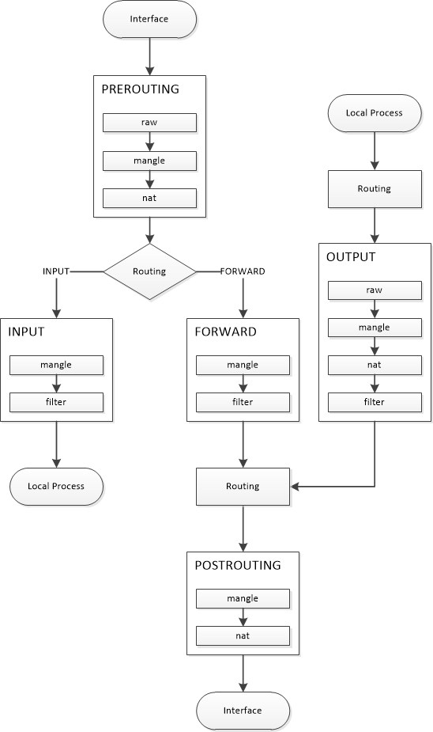

## User
```sh
# Add user (Debian)
adduser <user>

# Delete user (Debian)
deluser <user>

# Add user
useradd <user>

# Delete user
userdel <user>

# Change password
passwd [<user>]

# Lock user
passwd -l <user>

# Unlock user
passwd -u <user>

# Expire user password (force user to change password)
passwd -e <user>

# Set password expire day
passwd -x <day> <user>

# User database file
/etc/passwd

# Password file
/etc/shadow
```

## Shell
```sh
# Shell list
/etc/shells

# Chanage shell
chsh -s <shell> <user>
```

## [Ubuntu sharing desktop disable encryption reference](https://askubuntu.com/a/487267/235264)

```sh
dconf-editor
# org > gnome > desktop > remote-accessand > require-encryption

# or
gsettings set org.gnome.Vino require-encryption false
```

## Open file manager from CLI

```sh
xdg-open <path>
```

## Remove current session bash history
```sh
unset HISTFILE
# or
kill -9 $$
# $$ == Current shell PID
```

## Delete all bash history
```sh
# For Bash
history -c
# or
echo > $HISTFILE
# or
HISTSIZE=0
```

## `grub`

Hold `Shift` when boot to show `grub`

```sh
# Find all OS, update GRUB config, install GRUB to MBR / UEFI
update-grub

# Auto-Generate GRUB config path
vi /boot/grub/grub.cfg

# GRUB option
vi /etc/default/grub

# Set default to last selected option
# Add the following lines to /etc/default/grub
GRUB_DEFAULT=saved
GRUB_SAVEDEFAULT=true
```

## Ping
```sh
# Display timeout
ping -O <ip>

# Display time
ping <ip> | while read log; do
  echo "$(date): $log";
done
```

## Hardware

| Command | Description |
| --- | --- |
| `lsusb` | List USB devices |
| `lsblk` | List block devices |
| `lspci` | List PCI devices |
| `lspci -nn` | List PCI devices and devices code |
| `lspci -k` | List PCI devices and kernel driver |
| `cat /proc/cpuinfo` | Show CPU info |
| `free` | Show memory info |
| `df` | Disk free space |
| `df -h` | Disk free space in human readable format |

## Kernel module

`module-name` is same as `module_name`

| Command | Description |
| --- | --- |
| `lsmod` | List module |
| `insmod <module>` | Add module |
| `rmmod <module>` | Remove module |
| `modprobe <module>` | Add module and dependencies |
| `modprobe -r <module>` | Remove module and dependencies |
| Insert `blacklist <module>` into `/etc/modprobe.d/*.conf` | Blacklist module |
| Insert `install <module> /bin/false` into `/etc/modprobe.d/*.conf` | Blacklist module even other modules depend on it |

## `bash`

| Command | Description |
| --- | --- |
| `Tab` | Complete command |
| `Ctrl`+`D` | Exit |
| `Ctrl`+`L` | Clear screen |
| `Ctrl`+`R` | Search history |
| `!!` | Previous command |
| `!<string>` | Most recent command starting with `<string>` |

## [Jobs](http://www.linuxnix.com/11-fc-bg-jobs-commands-know/)

| Command | Description |
| --- | --- |
| `Ctrl`+`Z` | Suspend current process |
| `Ctrl`+`C` | Terminate current process |
| `jobs` | List job |
| `<command> &` | Run command in background |
| `%[<job spec>] &` or `bg [%<job spec>]` | Resume job in background (default is current job) |
| `%[<job spec>]` or `fg [%<job spec>]` | Resume job in foreground (default is current job) |
| `kill [%<job spec>]` | Kill job |
| `disown [%<job spec>]` | Don't terminate job when terminal exit (default is all jobs) |
| `nohup <command>` | Don't terminate command when terminal exit (no hangup) |

## File permission
Only change directory permission
```sh
chmod <permission> $(find -type d)
```

Only change file permission
```sh
chmod <permission> $(find -type f)
```

## Service
Enable / Disable service auto start
```sh
# Ubuntu <= 14
update-rc.d <service> {enable|disable}

# systemd
systemctl {enable|disable} <service>
```

Start / Stop service
```sh
# Ubuntu <= 14
service <service> {start|stop}

# systemd
systemctl {start|stop} <service>
```

## Manual
```sh
# Show manual
man [<page>]

# Search manual
apropos <keyword>
```

## iptables

