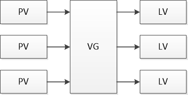

## Table of Contents
- [Table of Contents](#table-of-contents)
- [Command](#command)
  - [sed](#sed)
  - [awk](#awk)
  - [iptables](#iptables)
  - [User](#user)
  - [Password](#password)
- [Date](#date)
- [Shell](#shell)
  - [Shell list](#shell-list)
  - [Chanage shell](#chanage-shell)
  - [Open file manager from CLI](#open-file-manager-from-cli)
  - [Indicate command type](#indicate-command-type)
- [GRUB](#grub)
  - [Show GRUB when boot](#show-grub-when-boot)
  - [Update GRUB config](#update-grub-config)
  - [GRUB auto-generate config file](#grub-auto-generate-config-file)
  - [GRUB option file](#grub-option-file)
  - [Set GRUB default to last selected option](#set-grub-default-to-last-selected-option)
- [Hardware](#hardware)
- [Performance](#performance)
  - [Display memory info](#display-memory-info)
  - [Display process info](#display-process-info)
- [Kernel](#kernel)
  - [Kernel info](#kernel-info)
  - [Kernel module](#kernel-module)
- [Jobs](#jobs)
- [Trap](#trap)
- [File system](#file-system)
  - [`rsync`](#rsync)
  - [ACL](#acl)
  - [File permission](#file-permission)
  - [File attribute](#file-attribute)
  - [List open files](#list-open-files)
- [SELinux](#selinux)
  - [Get SELinux status](#get-selinux-status)
  - [Set SELinux status](#set-selinux-status)
- [Service](#service)
  - [Add / Delete service](#add--delete-service)
  - [Enable / Disable service auto start](#enable--disable-service-auto-start)
  - [Start / Stop service](#start--stop-service)
  - [Show service status](#show-service-status)
- [Manual / Help](#manual--help)
- [Time](#time)
- [DNS](#dns)
- [Sharing desktop](#sharing-desktop)
  - [Disable sharing desktop encryption (Ubuntu)](#disable-sharing-desktop-encryption-ubuntu)
- [File](#file)
  - [Copy](#copy)
- [Disk / Storage](#disk--storage)
  - [Disk usage](#disk-usage)
  - [Disk free space](#disk-free-space)
  - [List block devices / disk](#list-block-devices--disk)
  - [Show devices UUID (GUID)](#show-devices-uuid-guid)
  - [I/O priority](#io-priority)
    - [`ionice` (I/O nice)](#ionice-io-nice)
  - [Disk benchmark](#disk-benchmark)
    - [Write speed](#write-speed)
    - [Read speed](#read-speed)
  - [Partition](#partition)
    - [Partition table / Disk label](#partition-table--disk-label)
    - [Reload partition table](#reload-partition-table)
    - [Partition command](#partition-command)
  - [File system](#file-system-1)
    - [Resize file system](#resize-file-system)
- [LVM (Logical Volume Management)](#lvm-logical-volume-management)
  - [PV (Physical Volume)](#pv-physical-volume)
  - [VG (Volume Group)](#vg-volume-group)
  - [LV (Logical Volume)](#lv-logical-volume)
  - [Troubleshooting](#troubleshooting)
- [Find](#find)
- [Directory Stack](#directory-stack)
  - [Push directory](#push-directory)
  - [Pop and change to the directory](#pop-and-change-to-the-directory)
  - [List directory stack](#list-directory-stack)
- [`cron` / `crontab`](#cron--crontab)
- [`at`](#at)
- [OpenJDK (Java)](#openjdk-java)
  - [List installed JVM](#list-installed-jvm)
  - [Switch JVM](#switch-jvm)
- [Show Linux distribution / version](#show-linux-distribution--version)
- [Mount](#mount)
  - [Remount mount point in fstab](#remount-mount-point-in-fstab)
  - [Lists all mounted filesystems](#lists-all-mounted-filesystems)
  - [Mount CIFS / SMB / Windows Shared Folder](#mount-cifs--smb--windows-shared-folder)
- [Package management](#package-management)
  - [Install Development Tools](#install-development-tools)
  - [Add EPEL repository to CentOS / RHEL](#add-epel-repository-to-centos--rhel)
  - [Download package with dependence](#download-package-with-dependence)
  - [List installed package](#list-installed-package)
- [Last login](#last-login)
  - [Suppress `Last Login` message](#suppress-last-login-message)
  - [Clear last login log](#clear-last-login-log)
  - [Disable logging last login](#disable-logging-last-login)
- [Identify processes using files or sockets](#identify-processes-using-files-or-sockets)
- [Watch](#watch)
- [SSH](#ssh)
  - [SSH tunnel (port forward)](#ssh-tunnel-port-forward)
  - [Copy SSH public key to remote host](#copy-ssh-public-key-to-remote-host)
  - [SSH agent](#ssh-agent)
- [Auto start](#auto-start)
  - [LXDE](#lxde)
  - [bash](#bash)
- [FHS (Filesystem Hierarchy Standard) / Filesystem Structure](#fhs-filesystem-hierarchy-standard--filesystem-structure)
- [Using dash "`-`" as path argument](#using-dash-%22-%22-as-path-argument)

## Command

### [sed](sed.md)

### [awk](awk.md)

### [iptables](iptables.md)

### [User](User.md)

### [Password](User.md#password)

## Date

Display date

```bash
date [-u|--utc]
```

Set date

```bash
timedatectl set-time [<YYYY>-<MM>-<DD>] [<HH>:<MM>:<SS>]
```

```bash
date [-u|--utc] [MMDDhhmm[YYYY][.ss]]
```

```bash
date -s "YYYY-MM-DD hh:mm:ss"
```

Display timezone

```bash
date "+%Z %z"
```

```bash
cat /etc/timezone
```

Set timezone

```bash
tzselect
```

```bash
timedatectl set-timezone <timezone>
```

RTC (Real-Time Clock) as the local time

```bash
timedatectl set-local-rtc { true | t | yes | y | 1 }
```

RTC (Real-Time Clock) as the UTC (Coordinated Universal Time)

```bash
timedatectl set-local-rtc { false | f | no | n | 0 }
```

Convert timestamp to date time

```bash
date -d @<timestamp>
```


## Shell

### Shell list

```bash
cat /etc/shells
```

### Chanage shell

```bash
chsh -s <shell> [<user>]
```

```bash
usermod -s <shell> <user>
```

### Open file manager from CLI

```bash
xdg-open <path>
```

### Indicate command type

Type: `function`, `builtin`, or `file`

```bash
type [-a] <command>
```

Preserve file timestamp after edit (`bash`)

```bash
vi-preserve-time () {
    for file in "$@"; do
        local mtime=$(stat -c %y "$file")
        vi "$file"
        touch -d "$mtime" "$file"
    done
}
```


## GRUB

[Reference](https://help.ubuntu.com/community/Grub2)

### Show GRUB when boot

Hold `Shift` when boot

### Update GRUB config

Find all OS, update GRUB config, install GRUB to MBR / UEFI

```bash
update-grub
```

### GRUB auto-generate config file

```
/boot/grub/grub.cfg
```

### GRUB option file

```
/etc/default/grub
```

### Set GRUB default to last selected option

```bash
# /etc/default/grub
GRUB_DEFAULT=saved
GRUB_SAVEDEFAULT=true
```

## Hardware

| Command | Description |
| - | - |
| `lsusb` | List USB devices |
| `lspci` | List PCI devices |
| `lspci -nn` | List PCI devices and devices code |
| `lspci -k` | List PCI devices and kernel driver |
| `cat /proc/cpuinfo` | Show CPU info |
| `cat /proc/meminfo` | Show CPU info |

## Performance

### Display memory info

```bash
free <options>
```

| Option | Description |
| - | - |
| `-h` | Human readable unit |

### Display process info

```bash
# BSD syntax
ps [aux]

# Unix syntax
ps [-ef]
```

| Option | Description |
| - | - |
| `-e\|-A` | Entire / All processes |
| `-f` | Full format / Detail |

```bash
top
```

## Kernel

### Kernel info
```bash
uname -a
```

### Kernel module

> `module-name` is same as `module_name`

| Command | Description |
| - | - |
| `lsmod` | List module |
| `insmod <module>` | Add module |
| `rmmod <module>` | Remove module |
| `modprobe <module>` | Add module and dependencies |
| `modprobe -r <module>` | Remove module and dependencies |
| Add `blacklist <module>` to `/etc/modprobe.d/*.conf` | Blacklist module |
| Add `install <module> /bin/false` to `/etc/modprobe.d/*.conf` | Blacklist module even other modules depend on it |


## Jobs

[Reference](http://www.linuxnix.com/11-fc-bg-jobs-commands-know/)

| Command | Description |
| - | - |
| <kbd>Ctrl</kbd>+<kbd>Z</kbd> | Suspend current process |
| <kbd>Ctrl</kbd>+<kbd>C</kbd> | Terminate current process |
| `jobs` | List job |
| `<command> &` | Run command in background |
| `%[<job spec>] &` <br> `bg [%<job spec>]` | Resume job in background (default is current job) |
| `%[<job spec>]` <br> `fg [%<job spec>]` | Resume job in foreground (default is current job) |
| `kill [%<job spec>]` | Kill job |
| `disown [%<job spec>]` | Don't terminate job when terminal exit (default is all jobs) |
| `nohup <command>` | Don't terminate command when terminal exit (no hangup) |

## Trap

Execute command when shell receives signal

```bash
trap "<command>" <signal>[ ...]
```

Execute on shell exit

```bash
trap "<command>" { EXIT | 0 }
```

Show associated commands

```bash
trap -p
```

Show signal list

```bash
trap -l
```

## File system

### `rsync`

```bash
# <source>, <destination> = [[<user>@]<host>:]<path>
rsync <option> <source> <destination>
```

| Option | Description |
| - | - |
| `-a`, `--archive` | Archive mode, equals `-rlptgoD` (no `-H`, `-A`, `-X`) |
| `-H`, `--hard-links` | Preserve hard links |
| `-A`, `--acls` | Preserve ACLs (implies `-p`) |
| `-X`, `--xattrs` | Preserve extended attributes |
| `-v`, `--verbose` | Verbose |
| `-z`, `--compress` | Compress during the transfer |
| `--partial` | Keep partially transferred files |
| `--progress` | Show progress |
| `-P` | `--partial --progress` |
| `-e "ssh [-p <port>]"` | Use SSH, default use `rsync` daemon |

Trailing slash on `<source>`

```bash
rsync -av /src /dest
# same as
rsync -av /src/ /dest/src
```

### ACL

[Reference](https://access.redhat.com/documentation/en-us/red_hat_enterprise_linux/6/html/storage_administration_guide/acls-setting)

### File permission

~~Only change directory permission~~

```bash
chmod <permission> $(find -type d)
```

~~Only change file permission~~
```bash
chmod <permission> $(find -type f)
```

Change file owner and group

```bash
chown { <owner>[:<group>] | --reference <file> } <file>
```

Change file permission to `644`, directory to `755`

| Option | Description |
| - | - |
| `-R` | Recursive |
| `-h | --no-dereference` | Change symbolic links instead of referenced file |

```bash
chmod [-R] u=rw,go=r,a+X <path>
```

```bash
chmod [-R] a=r+X,u+w <path>
```

### File attribute

[Reference](http://man7.org/linux/man-pages/man1/chattr.1.html)

| Attribute | Description |
| - | - |
| `a` | Append only |
| `A` | No atime updates |
| `c` | Compressed |
| `i` | Immutable |
| `s` | Secure deletion |
| `S` | Synchronous updates |
| `u` | Undeletable |

List attribute

```bash
lsattr
```

Change attribute

```bash
chattr {+|-}<attribute> <file>
```

### List open files

```bash
lsof <path>
```


## SELinux

### Get SELinux status
```bash
sestatus [-v]
```

### Set SELinux status
```bash
setenforce { Enforcing | Permissive | 1 | 0 }
```

## Service

### Add / Delete service
```bash
# System V (Red Hat <= 6)
chkconfig { --add | --del } <service>
```

### Enable / Disable service auto start

```bash
# System V (Ubuntu <= 14)
update-rc.d <service> { enable | disable }

# System V (Red Hat <= 6)
chkconfig <service> { on | off }

# systemd (Ubuntu 16, Red Hat 7)
systemctl { enable | disable } <service>
```

### Start / Stop service

```bash
# System V (Ubuntu <= 14 and Red Hat <= 6)
service <service> { start | stop }

# systemd (Ubuntu 16, Red Hat 7)
systemctl { start | stop } <service>
```

### Show service status

```bash
# System V (Ubuntu <= 14 and Red Hat <= 6)
service <service> status

# systemd (Ubuntu 16, Red Hat 7)
systemctl status <service>
```

## Manual / Help

Show manual

```bash
man [<page>]
```

Search manual

```
apropos <keyword>
```


## Time

Force sync time

```bash
service ntpd stop
ntpd -gq
service ntpd start
```


## DNS

```bash
vi /etc/resolv.conf
```


## Sharing desktop

### Disable sharing desktop encryption (Ubuntu)

[Reference](https://askubuntu.com/a/487267/235264)

```bash
dconf-editor
# org > gnome > desktop > remote-accessand > require-encryption
```

```bash
gsettings set org.gnome.Vino require-encryption false
```

## File

### Copy

```bash
cp [<option>] <source> <destination>
```

| Option | Description |
| - | - |
| `-p \| --preserve[=<attributes>]` | Preserve mode, ownership, timestamps |
| `-R \| -r \| --recursive` | Copy directories recursively |

## Disk / Storage

### Disk usage

```bash
du <option> <path>
```

| Option | Description |
| - | - |
| `-h` | Human readable |
| `-s` | Summarize: Display only a total for each argument |

Sort human readable disk usage

```bash
du -hs <path> | sort -h -r
```

### Disk free space

```bash
df <option>
```

| Option | Description |
| - | - |
| `-h` | Disk free space in human readable format |

### List block devices / disk

```bash
lsblk
```

### Show devices UUID (GUID)

```bash
lsblk { -f | --fs }
```

```bash
blkid
```

```bash
ls /dev/disk/by-uuid/
```

### I/O priority

#### `ionice` (I/O nice)

Get I/O priority

```bash
ionice [-p <PID>]
```

Set I/O priority

| Class | Description |
| - | - |
| 0 | None |
| 1 | Realtime |
| 2 | Best-effort |
| 3 | Idle |

```bash
# <level> = 0 to 7, only for best-effort and realtime
ionice 
    { -c | --class } <class>
    [{ -n | --classdata } <level>] 
    { <command> | -p <PID> }
```

### Disk benchmark

#### Write speed

```bash
dd if=/dev/zero of=<file> bs=<size>[K|M|G] count=<count>[K|M|G] { conv=fsync | oflag={sync|dsync|direct} }
```

| Option | Description |
| - | - |
| `conv=fsync` | Synchronize before finishing |
| `dsync` | Synchronized I/O for data |
| `sync` | Synchronized I/O for data and meta data |
| `direct` | Direct I/O |

#### Read speed

| Unit | Description |
| - | - |
| `c` | 1 |
| `w` | 2 |
| `b` | 512 |
| `kB` | 1000 |
| `K` | 1024 |
| `MB` | 1000² |
| `M` | 1024² |
| `GB` | 1000³ |
| `G` | 1024³ |
| `T` | 1024⁴ |
| `P` | 1024⁵ |
| `E` | 1024⁶ |
| `Z` | 1024⁷ |
| `Y` | 1024⁸ |

```bash
dd
    if=<file>
    of=/dev/null
    bs=<size>[<unit>]
    [count=<count>[<unit>]]
    iflag=direct
```

[drop_caches reference](https://www.kernel.org/doc/Documentation/sysctl/vm.txt)

```bash
# Synchronize cached writes to persistent storage
sync

# Free cache
echo 3 > /proc/sys/vm/drop_caches

dd if=<file> of=/dev/null bs=<size>[K|M|G] [count=<count>[K|M|G]]
```

Read speed test without prior cache

```bash
hdparm -t /dev/<device>
```

Read speed test with buffer

```bash
hdparm -T /dev/<device>
```

### Partition

#### Partition table / Disk label

- MBR (Master Boot Record) / DOS
  - Max size 2 TiB (2³² sectors × 2⁹ bytes per sector)
  - Max 4 primary partition
- GPT (GUID Partition Table)
  - Max size 8 ZiB (2⁶⁴ sectors × 2⁹ bytes per sector)
  - Unlimited partition (Windows support 128 partitions)

#### Reload partition table

```bash
partprobe /dev/<device>
```

#### Partition command

- `fdisk` ([Reference](https://wiki.archlinux.org/index.php/Fdisk))
  - Common
  - Not support GPT before `util-linux` 2.23
- `parted`
  - Support GPT
- `gdisk` (GPT fdisk)
  - Support GPT

### File system

#### Resize file system

ext2 / ext3 / ext4

```bash
# Force check file system
e2fsck -f <device>
resize2fs [-M] <device> [<size>[<unit>]]
```

| Unit | Description |
| - | - |
| `-M` | Minimize size |

| Unit | Description |
| - | - |
| `s` | 512 byte sectors |
| `K` | 1024 |
| `M` | 1024² |
| `G` | 1024³ |

## LVM (Logical Volume Management)

[Reference](https://www.digitalocean.com/community/tutorials/an-introduction-to-lvm-concepts-terminology-and-operations) / [Reference](https://www.digitalocean.com/community/tutorials/how-to-use-lvm-to-manage-storage-devices-on-ubuntu-16-04)

Config file

```bash
/etc/lvm/lvm.conf
```

| Abbreviation | Name |
| - | - |
| PV | Physical Volume |
| VG | Volume Group |
| LV | Logical Volume |



Scan for all available devices for LVM

```bash
lvmdiskscan
```

```bash
pvscan
```

Change partition type ID to LVM (Optional)

```bash
gdisk <device>

Command (? for help): t
Partition number (1-3): <partition>
Hex code or GUID (L to show codes, Enter = 8300): 8e00
Command (? for help): w
```

```bash
fdisk <device>

Command (m for help): t
Partition type (type L to list all types): L
Partition type (type L to list all types): <Linux LVM type ID>
Command (m for help): w
```

### PV (Physical Volume)

Create PV

```bash
# <device> = <disk> | <partition>
pvcreate <device>[ ...]
```

Remove PV

```bash
pvmove <PV>
vgreduce <VG> <PV>
pvremove <PV>
```

Show PV information

```bash
pvs
```

```bash
pvdisplay
```

### VG (Volume Group)

Create VG

```bash
vgcreate <VG name> <PV> ...
```

Add PV to VG

```bash
vgextend <VG name> <PV> ...
```

Remove VG

```bash
vgremove <VG name>
```

Show VG information

```bash
vgs
```

```bash
vgdisplay
```

### LV (Logical Volume)

Create LV

```bash
lvcreate 
    [
        -L <size>[K|M|G|T|P|E] |
        -l <percent>[%{VG|FREE}]
    ]
    –type { linear | raid1 | raid5 | raid6 }
    -n <LV name>
    <VG name>
```

Show LV information

```bash
lvs
```

```bash
lvdisplay
```

Remove LV
```bash
lvremove <LV>
```

Resize LV

```bash
lvresize 
    {
        { -L | --size } {+|-}<size>[K|M|G|T|P|E] |
        { -l | --extends } {+|-}<percent>[%{VG|FREE}]
    }
    # Auto resize2fs
    [ -r | --resizefs ]
    <LV>
```

Extent LV

`lvextend <size>` = `lvresize +<size>`

Reduce LV

`lvreduce <size>` = `lvresize -<size>`

- Unmount LV
  ```bash
  umount <LV>
  ```
- Resize LV
  ```bash
  lvresize 
    -L [-]<size>[K|M|G|T|P|E]
    --resizefs
    <LV>
  ```

  Same as

  - Check file system
    ```bash
    fsck -f <LV>
    ```
  - Resize file system
    ```bash
    resize2fs <LV> <size>[s|K|M|G]
    ```
  - Resize LV
    ```bash
    lvresize 
      -L [-]<size>[K|M|G|T|P|E]
      <LV>
    ```

### Troubleshooting

`Device <device> excluded by a filter.`

```bash
pvcreate -vvv <device> |& grep <device>
```

`Skipping: Partition table signature found`

```bash
# Wipe all magic strings (BE CAREFUL!)
wipefs --all <device>
```

## Find

Run command in `find` result, `{}` is result path

```bash
find [<path>] [[!] <expression>] -exec <command> {} +
```

`<command> {} +` will expand to `<command> <path> <path> ...`

```bash
find [<path>] [[!] <expression>] -exec <command> {} \;
```

`<command> {} \;` will expand to `<command> <path>; <command> <path>; ...`

| Expression | Description |
| - | - |
| `-name "<glob pattern>"` | Match file name |
| `-iname "<glob pattern>"` | Match file name with case insensitive |
| `-type { f \| d }` | File / Directory |
| `-mtime [+\|-]<days>` | Last modified time |
| `-atime [+\|-]<days>` | Last accessed time |
| `-size [+\|-]<size>[k\|M\|G]` | File size |

| Time Expression | Description |
| - | - |
| | `diff = int(day(current_time - file_time))` |
| `+<days>` | `diff > <days>` |
| `-<days>` | `diff < <days>` |
| `<days>` | `diff == <days>` |


## Directory Stack

[Reference](https://unix.stackexchange.com/a/270437/104608)

### Push directory
```bash
pushd <directory>
```

### Pop and change to the directory
```bash
popd
```

### List directory stack
```bash
dirs [-v]
```


## `cron` / `crontab`

[Reference](https://www.computerhope.com/unix/ucrontab.htm)

User `crontab` file

```
/var/spool/cron/crontabs/<user>
```

`crontab` file

```bash
/etc/crontab

# Debian only
/etc/cron.d/
```

## `at`

Check if `atd` is running

```bash
systemctl status atd.service
```

Run command at a time

```bash
at <time spec>
<command>
[...]
<Ctrl + D>
```

```bash
at <time spec> <<END
<command>
[...]
END
```

```bash
echo "<command>" | at <time spec>
```

| | |
|-|-|
| `<time spec>` | `{ NOW | <time> | <date> | <time> <date> } [{+|-} <period> <unit>]` |
| `<time>` | `{ <HH>:<MM> [AM|PM] } [UTC]` |
| `<date>` | `<month name> <day> [<year>] | MM/DD/[YY]YY | [YY]YY-MM-DD | [NEXT] <day of week> | TODAY | TOMORROW `
| `<month name>` | `JAN | FEB | MAR | APR | MAY | JUN | JUL | AUG | SEP | OCT | NOV | DEC` |
| `<day of week>` | `SUN | MON | TUE | WED | THU | FRI | SAT` |
| `<unit>` | `MINUTE | HOUR | DAY | WEEK | MONTH | YEAR` |

List job

```bash
atq
```

```bash
at -l
```

Remove job

```bash
atrm <job ID>
```

```bash
at {-r|-d} <job ID>
```

View job

```bash
at -c <job ID>
```

## OpenJDK (Java)

### List installed JVM
```bash
update-java-alternatives --list
```

### Switch JVM
```bash
update-java-alternatives --set <JVM name>
```


## Show Linux distribution / version

```bash
cat /etc/*-release
cat /proc/version
uname -a

# For systemd
hostnamectl

# For Debian
lsb_release -a
```


## Mount

```bash
mount [-t <type>] { <source> | <device> } <directory>
```

### Remount mount point in fstab
```bash
# rw: read-write
mount -o remount[,rw] <directory>
```

### Lists all mounted filesystems
```bash
# -l: lable
mount [-l] [-t type]
```

### Mount CIFS / SMB / Windows Shared Folder

| Option | Description |
| - | - |
| `username=<username>` | Username |
| `password=<password>` | Password |
| `domain=<domain>` | Domain |
| `vers=1.0` | SMBv1 (Default) |
| `vers=2.0` | SMBv2.002 for Windows Vista SP1 and 2008 |
| `vers=2.1` | SMBv2.1 for Windows 7 and 2008R2 |
| `vers=3.0` | SMBv3.0 for Windows 8 and 2012 |
| `noperm` | Client bypass permission checks |

```bash
# mount.cifs = mount -t cifs
mount.cifs -o <option>[,...]] //<host>/<share name> <directory>
```

## Package management

### Install Development Tools

CentOS

```bash
# List available groups
yum group list

# Install "Development Tools"
yum group install "Development Tools"
```

Ubuntu

```bash
apt install build-essential
```

MSYS2

```bash
pacman -S base-devel
```

### Add EPEL repository to CentOS / RHEL

[Reference](https://fedoraproject.org/wiki/EPEL)

```bash
sudo yum install https://dl.fedoraproject.org/pub/epel/epel-release-latest-7.noarch.rpm
```

### Download package with dependence

Debian

[Reference](https://stackoverflow.com/a/41428445/1877620)

```bash
# -i = --important : Show only Depends and Pre-Depends
sudo apt-get download $(apt-cache depends --recurse -i <package> | grep -v "^[ <]")

# Install
# -m = --fix-missing : Ignore missing packages
sudo apt-get install -m --no-download ./*
```

### List installed package

Debian

```bash
apt list --installed [<package name pattern>]

# -l = --list
dpkg -l [<package name pattern>]
```

## Last login

[Reference](https://linuxconfig.org/how-to-disable-last-login-message-on-rhel-linux)

### Suppress `Last Login` message
```bash
touch ~/.hushlogin
```

### Clear last login log
```bash
> /var/log/lastlog
```

### Disable logging last login
```bash
chattr +i /var/log/lastlog
```

## Identify processes using files or sockets

```bash
fuser <option> <file>
```

| Option | Description |
| - | - |
| `-v`, `--verbose` | Verbose |
| `-k`, `--kill` | Kill processes accessing the file |
| `{ -c | -m | --mount } { <mount point> | <device> }` | Mount point or device |

## Watch

Execute command periodically

```bash
watch [-n <seconds>] <command>
```

## SSH

### SSH tunnel (port forward)

> [Link](./SSH%20Tunnel.md)

### Copy SSH public key to remote host

```bash
ssh-copy-id [<options>] <host>
```

| Option | Description |
| - | - |
| `-i <id_rsa.pub>` | The public key file to be copy, default is `~/.ssh/id*.pub`
| `-p <port>` | TCP port |
| `"-o IdentityFile <id_rsa>"` | Use `<id_rsa>` key file to connect remote host |

### SSH agent

For `sh` / `bash`

```bash
eval $(ssh-agent -s)
```

For `csh` / `fish`

```bash
eval (ssh-agent -c)
```

Add SSH private key

```bash
ssh-add <private key path>
```

## Auto start

### LXDE

[Reference](https://wiki.archlinux.org/index.php/LXDE#Autostart)

- `~/.config/lxsession/LXDE/`
- `/etc/xdg/lxsession/LXDE/autostart`

### bash

`~/.bashrc`

## FHS (Filesystem Hierarchy Standard) / Filesystem Structure

[Reference](http://refspecs.linuxfoundation.org/fhs.shtml)

```bash
man hier
```

## Using dash "`-`" as path argument

[Reference](http://tldp.org/LDP/abs/html/special-chars.html#DASHREF2)

使用 "`-`" 做為檔案路徑參數時，一般有以下用途

- Redirection from `stdin` / to `stdout`
- `cd -` change to previous working directory
