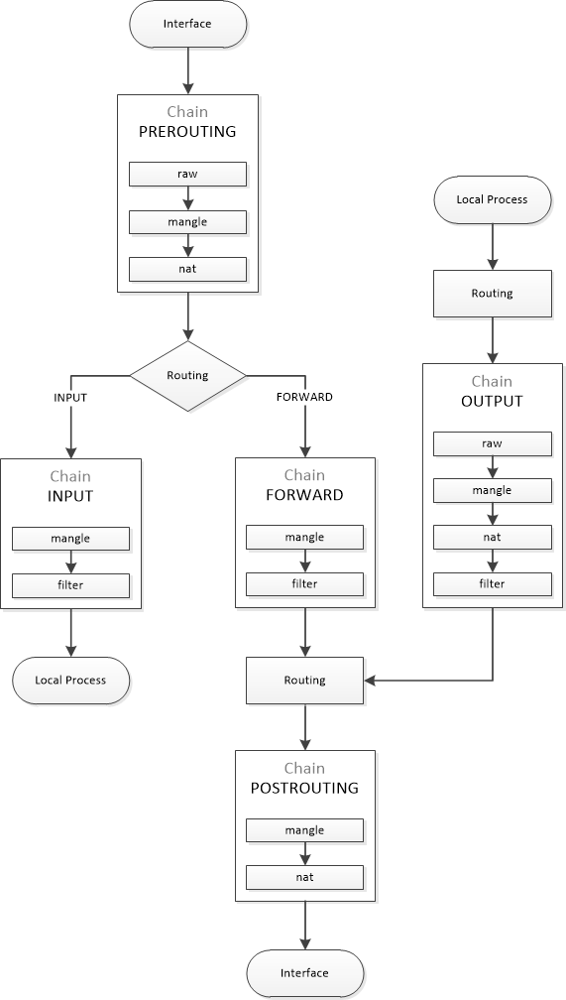

## iptables

| Description | Command |
| --- | --- |
| Verbose list rules | `iptables -v -L [<chain>]` |
| List rules | `iptables -S [<chain>]` |
| Dump iptables to file | `iptables-save > <file>` |
| Restore iptables from file | `iptables-restore < <file>` |
| Save iptables (Red Hat <= 6) | `service iptables save` |
| Chains | `INPUT` `OUTPUT` `FORWARD` `PREROUTING` `POSTROUTING` |
| Tables | `raw` `filter` `nat` `mangle` `security` (Default `filter`) |
| Targets | `ACCEPT` `DROP` `QUEUE` `RETURN` `REJECT` `LOG` |

## Policy
```sh
iptables -P <chain> <target>
```


