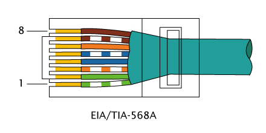
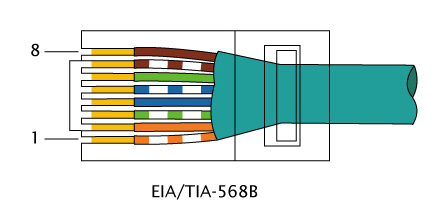

# Table of Contents
- [Table of Contents](#Table-of-Contents)
- [Copper](#Copper)
  - [10BASE-T](#10BASE-T)
  - [100BASE-TX](#100BASE-TX)
  - [1000BASE-T](#1000BASE-T)
  - [10GBASE-T](#10GBASE-T)
  - [Pinout](#Pinout)
- [Fiber](#Fiber)
  - [1000BASE‑LX/LH](#1000BASE%E2%80%91LXLH)
  - [1000BASE‑SX](#1000BASE%E2%80%91SX)
  - [SMF (Single Mode Fiber)](#SMF-Single-Mode-Fiber)
  - [MMF (Multi Mode Fiber)](#MMF-Multi-Mode-Fiber)
- [Slot](#Slot)
  - [SFP (Small Form-factor Pluggable)](#SFP-Small-Form-factor-Pluggable)
  - [SFP+](#SFP)
  - [GBIC (GigaBit Interface Converter)](#GBIC-GigaBit-Interface-Converter)
  - [XFP](#XFP)
  - [X2](#X2)

# Copper

## 10BASE-T

Usually use in WOL (Wake On LAN)

|  |  |
| - | - |
| Speed | 10 Mb/s |
| Distance | 100m |
| Cable | Cat 5, Cat 5e, Cat 6 |
| Connector | 8P8C |

## 100BASE-TX

|  |  |
| - | - |
| Speed | 100 Mb/s |
| Distance | 100m |
| Cable | Cat 5, Cat 5e, Cat 6 |
| Connector | 8P8C |

## 1000BASE-T

|  |  |
| - | - |
| Speed | 1 Gb/s |
| Distance | 100m |
| Cable | Cat 5, Cat 5e, Cat 6 |
| Connector | 8P8C |

[Auto MDI-X](https://en.wikipedia.org/wiki/Medium-dependent_interface) (Medium Dependent Interface, X = Crossover)

## 10GBASE-T

|  |  |
| - | - |
| Speed | 10 Gb/s |
| Distance | 55 m (Cat 6)  100 m (Cat 6a / Cat 7) |
| Cable | Cat 6, Cat 7 |
| Connector | 8P8C |

## Pinout

| Pin | 10BASE-T / 100BASE-TX  Signal ID | 1G / 10GBASE-T  Signal ID |
| - | - | - |
| 1 | TD+ | DA+ |
| 2 | TD- | DA- |
| 3 | RD+ | DB+ |
| 4 | - | DC+ |
| 5 | - | DC- |
| 6 | RD- | DB- |
| 7 | - | DD+ |
| 8 | - | DD- |

[8P8C](https://en.wikipedia.org/wiki/Modular_connector) (Referred to incorrect name: RJ45)

TIA/EIA-568A

TIA/EIA-568B

# Fiber

[Reference](https://www.cisco.com/c/en/us/products/collateral/interfaces-modules/gigabit-ethernet-gbic-sfp-modules/datasheet-c78-366584.html)

## 1000BASE‑LX/LH

|  |  |
| - | - |
| Fiber type | SMF / MMF with Mode Conditioning Patch Cable |
| Distance | SMF: 5 km, MMF: 550 m |
| Wavelength | 1,310 nm, 1,550 nm |
| Slot | GBIC, SFP |
| Connector | SC, LC |

## 1000BASE‑SX

|  |  |
| - | - |
| Fiber type | MMF |
| Distance | 550 m |
| Wavelength | 770 - 860 nm |
| Slot | GBIC, SFP |
| Connector | SC, LC |

## SMF (Single Mode Fiber)

[ISO/IEC 11801](https://en.wikipedia.org/wiki/ISO/IEC_11801)

|  |  |
| - | - |
| OS (Optical Single-mode) | OS1, OS2 |
| Core diameter | 8 - 10.5 µm |
| Cladding diameter | 125 µm |

## MMF (Multi Mode Fiber)

[Reference](https://en.wikipedia.org/wiki/Multi-mode_optical_fiber)

[ISO/IEC 11801](https://en.wikipedia.org/wiki/ISO/IEC_11801)

|  |  |
| - | - |
| OM (Optical Multi-mode) | OM1 - OM5 |
| Core diameter | 50 – 100 µm, OM1 = 62.5 µm, OM2, OM3, OM4, OM5 = 50 µm |
| Cladding diameter | 125 µm |

# Slot

## SFP (Small Form-factor Pluggable)

Speed: 1 Gb/s

Hot-pluggable

## SFP+

Compatible SFP module

Speed: 10 Gb/s

Hot-pluggable

## GBIC (GigaBit Interface Converter)

#obsolete

## XFP

#uncommon #obsolete

## X2

#uncommon #obsolete
