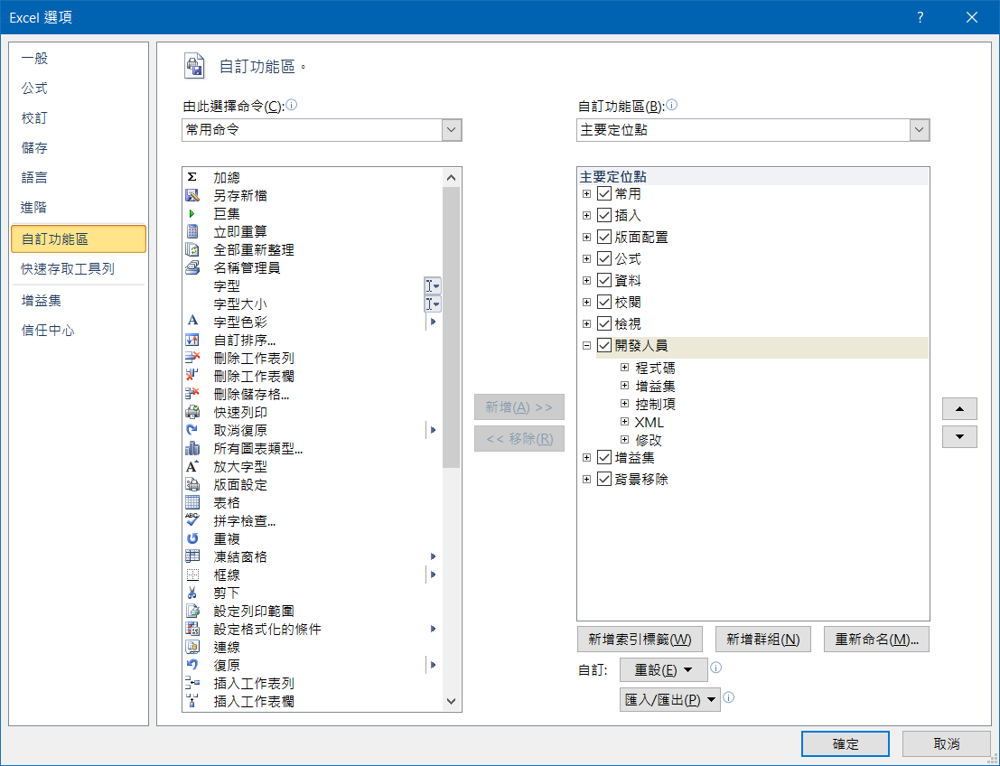
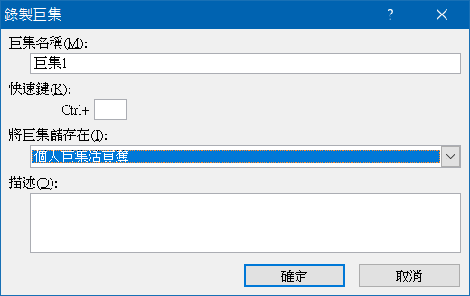
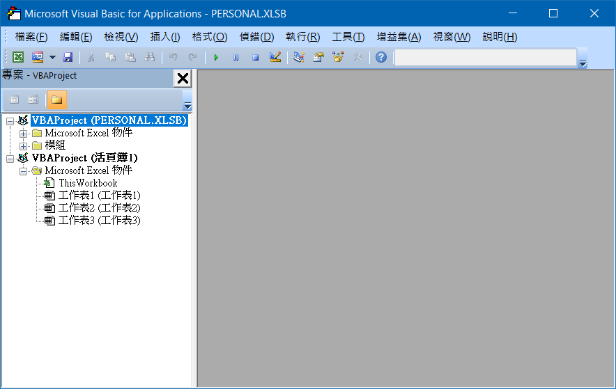

## 多個儲存格輸入

- 選取多個儲存格
- 輸入內容（可以是公式，會以參照位址填滿）
- <kbd>Ctrl</kbd> + <kbd>Enter</kbd>

## Enable "Developer" tab



## Personal Macro / Global Macro

[Reference](https://support.office.com/en-us/article/create-and-save-all-your-macros-in-a-single-workbook-66c97ab3-11c2-44db-b021-ae005a9bc790)

- Developer
  - Record Macro
- Store macro in
  - Personal Macro Workbook
- Developer
  - Stop Recording



Edit Personal Macro

- Developer
  - Visual Basic
    - VBA Project (PERSONAL.xlsb)



## Paste value

```vb
Sub PasteText()
    ' Paste:=xlPasteValues will cause 1004 error
    ' xlPasteAll only paste value, Bug?
    Selection.PasteSpecial Paste:=xlPasteAll
End Sub
```

## Keyboard Shortcut

> [Reference](https://support.microsoft.com/en-us/office/keyboard-shortcuts-in-excel-1798d9d5-842a-42b8-9c99-9b7213f0040f)

| Description | Key |
| - | - |
| Edit cell | <kbd>F2</kbd> |
| New line in the same cell | <kbd>Alt + Enter</kbd> |
| Paste value | <kbd>Ctrl + Alt + V</kbd> <kbd>V</kbd> |
| Copy the the topmost cell of a selected range into the cells below | <kbd>Ctrl + D</kbd> |
| Apply the General number format | <kbd>Ctrl + Shift + Tilde(~)</kbd> |
| Apply the Currency format | <kbd>Ctrl + Shift + Dollar($)</kbd> |
| Apply the Percentage format | <kbd>Ctrl + Shift + Percent(%)</kbd> |
| Apply the Date format | <kbd>Ctrl + Shift + Number(#)</kbd> |
| Apply the Time format | <kbd>Ctrl + Shift + At(@)</kbd> |
| Apply the Number format | <kbd>Ctrl + Shift + Exclamation point(!)</kbd> |
| Repeat the last action | <kbd>Ctrl + Y</kbd> |
| Select row | <kbd>Shift + Space</kbd> |
| Select column | <kbd>Ctrl + Space</kbd> |
| Insert row / column | <kbd>Ctrl + Shift + Plus(+)</kbd> |
| Delete row / column | <kbd>Ctrl + Minus(-)</kbd> |
| Enter the current date | <kbd>Ctrl + Semi-colon(;) |
| Enter the current time | <kbd>Ctrl + Shift + Colon(:) |
| Move to edge of data range | <kbd>Ctrl + Arrow</kbd> |
| Move to edge of data range | <kbd>End</kbd> <kbd>Arrow</kbd> |
| Open the list of validation / auto-complete | <kbd>Alt + Down</kbd> |

## Note

- Global object is `Application` (like `window` in JavaScript)

## Highlight duplicates

[Reference](https://support.microsoft.com/en-us/office/find-and-remove-duplicates-00e35bea-b46a-4d5d-b28e-66a552dc138d)

- Select the cells you want to check for duplicates
- **Home** > **Conditional Formatting** > **Highlight Cells Rules** > **Duplicate Values**

## Formula / Function

### Operator

| Operator | Description |
| - | - |
| `+` | Addition |
| `–` | Subtraction |
| `*` | Multiplication |
| `/` | Division |
| `%` | Percent |
| `^` | Exponentiation |
| `=` | Equal to |
| `>` | Greater than |
| `<` | Less than |
| `>=` | Greater than or equal to |
| `<=` | Less than or equal to |
| `<>` | Not equal to |
| `&` | Concatenate |
| `Space` | Intersection range |

### Reference

> [Reference](https://support.microsoft.com/en-us/office/overview-of-formulas-in-excel-ecfdc708-9162-49e8-b993-c311f47ca173?wt.mc_id=otc_excel)

Reference to cell

```xlsx
<column><row>
```

Reference to range

```xlsx
<column><row>:<column><row>
```

Reference to column

```xlsx
<from column>:<to column>
```

Reference to row

```xlsx
<from row>:<to row>
```

Reference to sheet

```xlsx
[<sheet name>[:<sheet name>]!]<cell>
```

Absolute reference

```xlsx
$<column>$<row>
```

> When editing, press <kbd>F4</kbd> to change between relative and absolute

### VLOOKUP

找尋 `<range>` 第 1 欄中等於 `<value>` 的列，然後傳回 `<column>` 所指的欄的值。如果找不到會傳回 `#N/A`。

```xlsx
VLOOKUP(
  <value | cell to lookup>,
  <range>,
  <column of return value>,
  { TRUE | FALSE }
)
```

|  |  |
| - | - |
| `TRUE` | Approximate match |
| `FALSE` | Exact match |

Demo

|  | A | B |
| - | - | - |
| 1 | Apple | 10 |
| 2 | Banana | 20 |
| 3 | Cat | 30 |

```xlsx
=VLOOKUP("Apple", A1:B3, 2, FALSE)

# 10
```

Equal to

> `VLOOKUP` search from begin, but `MATCH` will searh from the end

```xlsx
=INDEX(B1:B3, MATCH("Apple", A1:A3, 0))
```

### INDEX

Return the value of `<row>` in `<range>`

```xlsx
INDEX(<range>, <row>[, <column>])
```

### MATCH

Retrun the index of `<value>` in `<range>`

```xlsx
MATCH(<value>, <range>, 0)
```

### SUM

```xlsx
SUM(<value | range>[, ...])
```

### IF

```xlsx
IF(
  <expression>,
  <the return value if TRUE>,
  <the return value if FALSE>
)
```

### IFS

> For Excel 2016 and above

```xlsx
IFS(
  <expression>, <the return value if TRUE>
  [, ...]
)
```

```xlsx
IFS(
  <expression 1>, <value 1>,
  <expression 2>, <value 2>,
  TRUE, <value 3>
)
```

same as

```xlsx
IF(
  <expression 1>, <value 1>, 
  IF(<expression 2>, <value 2>, <value 3>)
)
```

### SUMIF

```xlsx
SUMIF(
  <range>,
  "<comparison operator><value>"
  <range of value to sum>
)
```

Demo

|  | A | B |
| - | - | - |
| 1 | Apple | 10 |
| 2 | Banana | 20 |
| 3 | Apple | 30 |
| 4 | Cat | 40 |

```xlsx
=SUMIF(A1:A4, "=Apple", B1:B4)

# 40
```

### SUMIFS

```xlsx
SUMIF(
  <range of value to sum>,
  <range>, "<comparison operator><value>"
  [, ...]
)
```

Demo

|  | A | B | C |
| - | - | - | - |
| 1 | Apple | Red | 10 |
| 2 | Banana | Yellow | 20 |
| 3 | Apple | Green | 30 |
| 4 | Cat | White | 40 |
| 5 | Apple | Red | 50 |

```xlsx
=SUMIFS(C1:C5, A1:A5, "=Apple", B1:B5, "=Red")

# 60

=SUMIFS(C1:C5, A1:A5, "=Apple", B1:B5, "=Green")

# 30
```

### CHOOSE

```xlsx
CHOOSE(<index>, <value | range>[, ...])
```

Equal to JavaScript

```js
[<value>, ...][<index> - 1]
```
