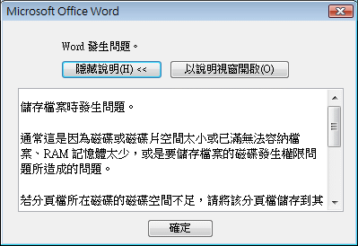
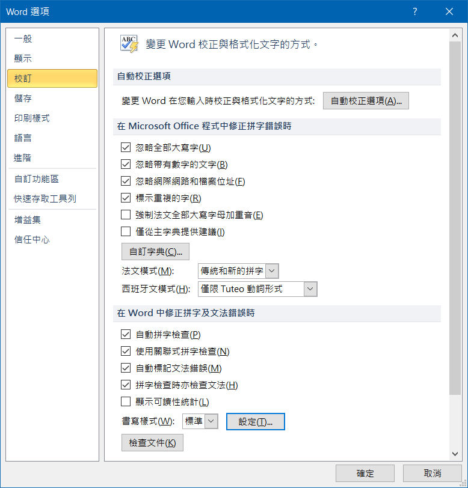

# Change Office VBA display language

Change system locale

# Connect encrypted Access DB in Excel

`Access` > `File` > `Open` > `Open Exclusive`

`Access` > `File` > `Option` > `Client Settings` > `Use Legacy Encryption`

`Access` > `File` > `Info` > `Encrypt with Password`

# Error

如果經常出現以下錯誤

可以關閉 `修正拼字及文法錯誤` 裡的所有選項

