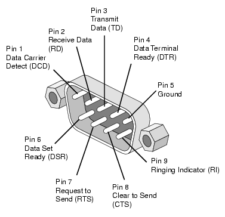

# SoC (System on a Chip)

- Atmel (Microchip)
  - AVR
    - ATtiny85
      - DigiSpark
- STMicroelectronics
- Espressif
  - ESP8266 (WiFi)
    - ESP-01
    - ESP-02
    - ...
  - ESP8285 = ESP8266 + 1MiB Flash
  - ESP32 (WiFi + Bluetooth)

# USB to UART (RS232)

- WCH CH340 (UART)
- WCH CH341 (UART, I2C, SPI)
- Prolific PL2303 (Fake)
- Silicon CP2102
- FTDI232 (Expensive)

# Interface

- UART
  - [RS-232](https://en.wikipedia.org/wiki/RS-232)
    - [DB-9](https://www.db9-pinout.com/)
      - DTE (male)
      - DCE (female)
    - DB-25

## DB-9

| Pin | SIG | Name | DTE (male) |
| - | - | - | - |
| 1 | DCD | Data Carrier Detect | in |
| 2 | RXD | Receive Data | in |
| 3 | TXD | Transmit Data | out |
| 4 | DTR | Data Terminal Ready | out |
| 5 | GND | Signal Ground | - |
| 6 | DSR | Data Set Ready | in |
| 7 | RTS | Request To Send | out |
| 8 | CTS | Clear To Send | in |
| 9 | RI | Ring Indicator | in |

## Common usage

`RXD TXD GND [RTS CTS]`

# IR (Infrared)

| Wave length | Command |
| - | - |
| 850 nm | Night vision |
| 940 nm | Remote control |
