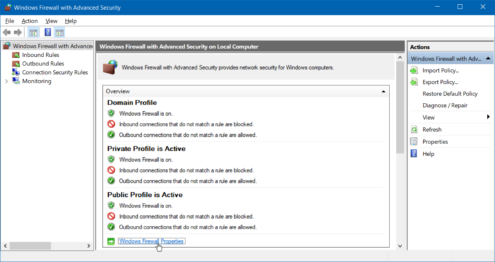

## Windows firewall change default to block ([reference](https://www.howtogeek.com/112564/how-to-create-advanced-firewall-rules-in-the-windows-firewall/))


## Credential Manager


## Remote Desktop
- Toggle full screen `Ctrl + Alt + Break`
- List remote desktop session `query session`
- Attach remote desktop session to console `tscon <session ID> /dest:console`

## Remote PowerShell
Enable remote PowerShell
```
# Change network profile to private

# Enable WinRM service
Enable-PSRemoting -Force

# Add host to trusted hosts
Set-Item WSMan:\localhost\Client\TrustedHosts (<IP|host name>[,<IP|host name>]|*)

# Restart WinRM
Restart-Service WinRM
```

Connect to remote PowerShell
```
Enter-PSSession -ComputerName <IP|host name> -Credential <user name>
```

## Hibernate
Disable hibernate (remove `hiberfil.sys` file)
```
powercfg /(hibernate|h) off
```
