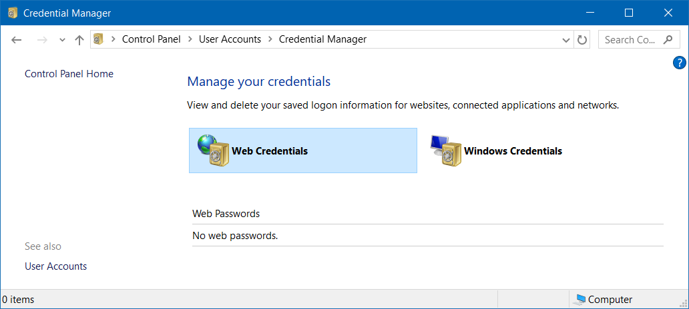

## Windows firewall change default to block
[Reference](https://www.howtogeek.com/112564/how-to-create-advanced-firewall-rules-in-the-windows-firewall/)


## Credential manager


List credentials
```cmd
cmdkey /list
```

## Remote desktop

Description | Command
--- | ---
Connect to remote | `mstsc [/v:<host>[:<port>]]`
Toggle full screen | <kbd>Ctrl</kbd> + <kbd>Alt</kbd> + <kbd>Break</kbd>
List remote desktop session | `query session`
Attach remote desktop session to console | `tscon <session ID> /dest:console`

## Hibernate
Enable / Disable hibernate (remove `hiberfil.sys` file)

[Reference](https://support.microsoft.com/en-us/help/920730/how-to-disable-and-re-enable-hibernation-on-a-computer-that-is-running)
```
powercfg { /hibernate | /h } { on | off }
```

## `.cab` file
- Extract `.cab`: `expand <file.cab>`
- Create `.cab`: `makecab <file> <file.cab>`

## File Permission (ACL)
[Reference](http://technet.microsoft.com/en-us/library/bb490872.aspx)

| Option | Permission |
| --- | --- |
| `n` | None |
| `r` | Read |
| `w` | Write |
| `c` | Change (Write) |
| `f` | Full Control |

Replace permission
```cmd
cacls <file> /p <user>:<permission>
```

Edit permission
```cmd
cacls <file> /e /p <user>:<permission>
```

Change owner
```cmd
cacls <file> /r <user>
```

## Registry
Registry file location

[Reference](http://msdn.microsoft.com/en-us/library/ms724877%28v=vs.85%29.aspx)

| Registry hive | Supporting files |
| --- | --- |
| HKEY_CURRENT_CONFIG | System, System.alt, System.log, System.sav |
| HKEY_CURRENT_USER | Ntuser.dat, Ntuser.dat.log |
| HKEY_LOCAL_MACHINE\SAM | Sam, Sam.log, Sam.sav |
| HKEY_LOCAL_MACHINE\Security | Security, Security.log, Security.sav |
| HKEY_LOCAL_MACHINE\Software | Software, Software.log, Software.sav |
| HKEY_LOCAL_MACHINE\System | System, System.alt, System.log, System.sav |
| HKEY_USERS\.DEFAULT | Default, Default.log, Default.sav |

Edit registry file
- Execute `regedit`
- Select the `HKEY_LOCAL_MACHINE` root key
- Menu `File` > `Load Hive...`
- Choose the DAT file for the registry you wish to edit
- You will be prompted for a name to load the hive into. The name does not matter. It just loads the registry hive into a subfolder using the name you provide
- You can then edit the registry you just loaded in the same manner as any other registry. All changes are made in real time, just as normal
- When you're done, go to the menu `File` > `Unload Hive...`

## Cortana
Disable Cortana in Windows 10
```sh
reg add "HKLM\SOFTWARE\Policies\Microsoft\Windows\Windows Search" /v "AllowCortana" /t REG_DWORD /d 0 /f
```

```powershell
# PowerShell
New-ItemProperty -Path "HKLM:\SOFTWARE\Policies\Microsoft\Windows\Windows Search" -Name "AllowCortana" -PropertyType DWord -Value 0 -Force
```

Enable Cortana in Windows 10
```sh
reg delete "HKLM\SOFTWARE\Policies\Microsoft\Windows\Windows Search" /v "AllowCortana" /f
```

```powershell
# PowerShell
Remove-ItemProperty -Path "HKLM:\SOFTWARE\Policies\Microsoft\Windows\Windows Search" -Name "AllowCortana"
```

## Allow input unicode with <kbd>Alt</kbd> + <kbd>+\<Code\></kbd>
[Reference](http://www.fileformat.info/tip/microsoft/enter_unicode.htm)
```sh
reg add "HKCU\Control Panel\Input Method" /v "EnableHexNumpad" /t REG_SZ /d 1 /f
```

## Enable / Disable the Local Built-In Administrator Account
[Reference](https://social.technet.microsoft.com/wiki/contents/articles/3040.windows-7-enable-disable-the-local-built-in-administrator-account.aspx)
```
net user administrator /active:{yes|no}
```

## Get OS Architecture (32-bit / 64-bit)
[Reference](https://www.lisenet.com/2014/get-windows-system-information-via-wmi-command-line-wmic/)
```cmd
wmic OS get OSArchitecture
```

```powershell
# PowerShell
(Get-CimInstance Win32_OperatingSystem).OSArchitecture
```

## SLP (System Locked Pre-installation) / SLIC (System License Internal Code)

Install license

```cmd
slmgr.vbs -ilc <path>
```

Install product key

```cmd
slmgr.vbs -ipk <product key>
```
