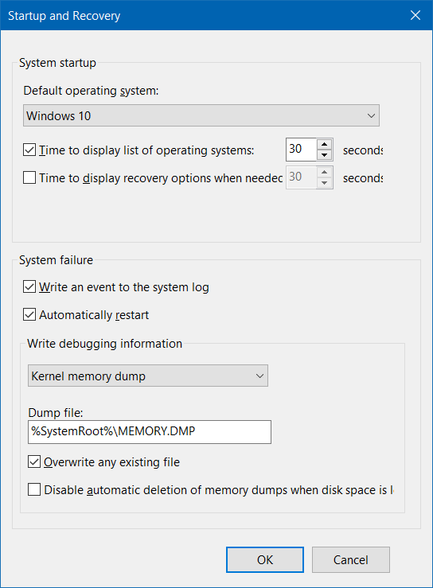

# Table of Contents
- [Table of Contents](#table-of-contents)
- [Network Profile](#network-profile)
- [User](#user)
  - [User Account Management / Auto Login](#user-account-management--auto-login)
  - [Computer Management / Local User](#computer-management--local-user)
  - [Create User](#create-user)
  - [Delete User](#delete-user)
  - [Password Expire](#password-expire)
- [Group Policy](#group-policy)
- [Windows firewall change default to block](#windows-firewall-change-default-to-block)
- [Credential Manager](#credential-manager)
- [Remote Desktop](#remote-desktop)
- [Hibernate](#hibernate)
- [`.cab` file](#cab-file)
- [File Permission (ACL)](#file-permission-acl)
- [Registry](#registry)
- [Cortana](#cortana)
- [Allow input unicode with <kbd>Alt</kbd> + <kbd>+\<Code\></kbd>](#allow-input-unicode-with-kbdaltkbd--kbdcodekbd)
- [Enable / Disable the Local Built-In Administrator Account](#enable--disable-the-local-built-in-administrator-account)
- [Get OS Architecture (32-bit / 64-bit)](#get-os-architecture-32-bit--64-bit)
- [SLP (System Locked Pre-installation) / SLIC (System License Internal Code)](#slp-system-locked-pre-installation--slic-system-license-internal-code)
- [Code page](#code-page)


# Network Profile

[PowerShell](PowerShell.md#network-profile)

# User

## User Account Management / Auto Login

```cmd
netplwiz.exe
```

## Computer Management / Local User
```cmd
lusrmgr.msc
```

## Create User

```cmd
net user <user name> [<password>] /add
```

```powershell
# PowerShell
New-LocalUser <user name> [-Password (Read-Host -AsSecureString) | -NoPassword]
```

## Delete User

```cmd
net user <user name> /delete
```

```powershell
# PowerShell
Remove-LocalUser <user name>
```

## Password Expire

```cmd
wmic UserAccount [where Name=<user name>] set PasswordExpires={True|False}
```

Using group policy

`Computer Configuration` > `Windows Settings` > `Security Settings` > `Password Policy` > `Maximum password age`

# Group Policy
```cmd
gpedit.msc
```

# Windows firewall change default to block
[Reference](https://www.howtogeek.com/112564/how-to-create-advanced-firewall-rules-in-the-windows-firewall/)


# Credential Manager


[Reference](https://docs.microsoft.com/en-us/windows-server/administration/windows-commands/cmdkey)

Add credential
```cmd
cmdkey /add:<target name> /user:<user name> /pass:<password>
```

Delete credential
```cmd
cmdkey /delete:<target name>
```

List credentials
```cmd
cmdkey /list
```

# Remote Desktop

Description | Command
--- | ---
Connect to remote | `mstsc [/v:<host>[:<port>]]`
Toggle full screen | <kbd>Ctrl</kbd> + <kbd>Alt</kbd> + <kbd>Break</kbd>
List remote desktop session | `query session`
Attach remote desktop session to console | `tscon <session ID> /dest:console`

# Hibernate
Enable / Disable hibernate (remove `hiberfil.sys` file)

[Reference](https://support.microsoft.com/en-us/help/920730/how-to-disable-and-re-enable-hibernation-on-a-computer-that-is-running)

[Reference](https://docs.microsoft.com/en-us/windows-hardware/design/device-experiences/powercfg-command-line-options)

```
powercfg { /hibernate | /h } [ on | off ]
powercfg { /hibernate | /h } /size <percent size>
powercfg { /hibernate | /h } /type { reduced | full }
```

# `.cab` file

Extract `.cab`
```cmd
expand <file.cab>
```

Create `.cab`
```cmd
makecab <file> <file.cab>
```

# File Permission (ACL)
[Reference](http://technet.microsoft.com/en-us/library/bb490872.aspx)

| Option | Permission |
| --- | --- |
| `n` | None |
| `r` | Read |
| `w` | Write |
| `c` | Change (Write) |
| `f` | Full Control |

Replace permission
```cmd
cacls <file> /p <user>:<permission>
```

Edit permission
```cmd
cacls <file> /e /p <user>:<permission>
```

Change owner
```cmd
cacls <file> /r <user>
```

# Registry
Registry file location

[Reference](http://msdn.microsoft.com/en-us/library/ms724877%28v=vs.85%29.aspx)

| Registry hive | Supporting files |
| --- | --- |
| HKEY_CURRENT_CONFIG | System, System.alt, System.log, System.sav |
| HKEY_CURRENT_USER | Ntuser.dat, Ntuser.dat.log |
| HKEY_LOCAL_MACHINE\SAM | Sam, Sam.log, Sam.sav |
| HKEY_LOCAL_MACHINE\Security | Security, Security.log, Security.sav |
| HKEY_LOCAL_MACHINE\Software | Software, Software.log, Software.sav |
| HKEY_LOCAL_MACHINE\System | System, System.alt, System.log, System.sav |
| HKEY_USERS\.DEFAULT | Default, Default.log, Default.sav |

Edit registry file
- Execute `regedit`
- Select the `HKEY_LOCAL_MACHINE` root key
- Menu `File` > `Load Hive...`
- Choose the DAT file for the registry you wish to edit
- You will be prompted for a name to load the hive into. The name does not matter. It just loads the registry hive into a subfolder using the name you provide
- You can then edit the registry you just loaded in the same manner as any other registry. All changes are made in real time, just as normal
- When you're done, go to the menu `File` > `Unload Hive...`

# Cortana
Disable Cortana in Windows 10
```cmd
reg add "HKLM\SOFTWARE\Policies\Microsoft\Windows\Windows Search" /v "AllowCortana" /t REG_DWORD /d 0 /f
```

```powershell
# PowerShell
New-ItemProperty -Path "HKLM:\SOFTWARE\Policies\Microsoft\Windows\Windows Search" -Name "AllowCortana" -PropertyType DWord -Value 0 -Force
```

Enable Cortana in Windows 10
```cmd
reg delete "HKLM\SOFTWARE\Policies\Microsoft\Windows\Windows Search" /v "AllowCortana" /f
```

```powershell
# PowerShell
Remove-ItemProperty -Path "HKLM:\SOFTWARE\Policies\Microsoft\Windows\Windows Search" -Name "AllowCortana"
```

# Allow input unicode with <kbd>Alt</kbd> + <kbd>+\<Code\></kbd>
[Reference](http://www.fileformat.info/tip/microsoft/enter_unicode.htm)
```cmd
reg add "HKCU\Control Panel\Input Method" /v "EnableHexNumpad" /t REG_SZ /d 1 /f
```

# Enable / Disable the Local Built-In Administrator Account
[Reference](https://social.technet.microsoft.com/wiki/contents/articles/3040.windows-7-enable-disable-the-local-built-in-administrator-account.aspx)
```
net user administrator /active:{yes|no}
```

# Get OS Architecture (32-bit / 64-bit)
[Reference](https://www.lisenet.com/2014/get-windows-system-information-via-wmi-command-line-wmic/)
```cmd
wmic OS get OSArchitecture
```

```powershell
# PowerShell
(Get-CimInstance Win32_OperatingSystem).OSArchitecture
```

# SLP (System Locked Pre-installation) / SLIC (System License Internal Code)

Install license

```cmd
slmgr.vbs -ilc <path>
```

Install product key

```cmd
slmgr.vbs -ipk <product key>
```

BSOD (Blue Screen of Death) dump

[BlueScreenView](https://www.nirsoft.net/utils/blue_screen_view.html)



# Code page

[Reference](https://docs.microsoft.com/en-us/windows-server/administration/windows-commands/chcp)

```cmd
chcp <code page>
```

Change active code page to UTF-8
```cmd
chcp 65001
```
