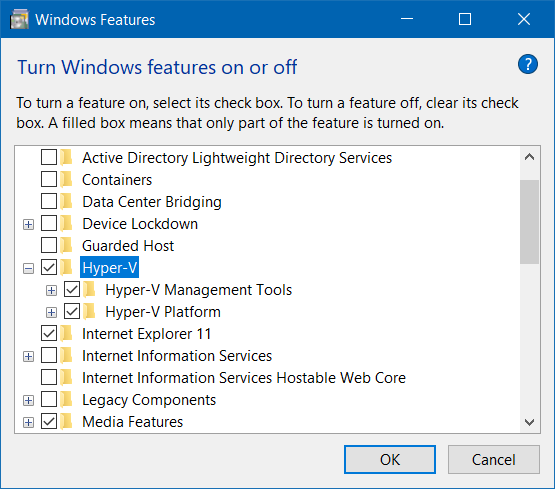

# Install / Enable Hyper-V

<!--truncate-->

> Ref: [Enable Hyper-V](https://learn.microsoft.com/en-us/virtualization/hyper-v-on-windows/quick-start/enable-hyper-v)

## Using GUI

- Open **Turn Windows features on or off**
- Enable **Hyper-V**



## Using DISM

```cmd
DISM /Online /Enable-Feature /All /FeatureName:Microsoft-Hyper-V
```

## Using PowerShell

```powershell
Enable-WindowsOptionalFeature -Online -FeatureName Microsoft-Hyper-V -All
```
