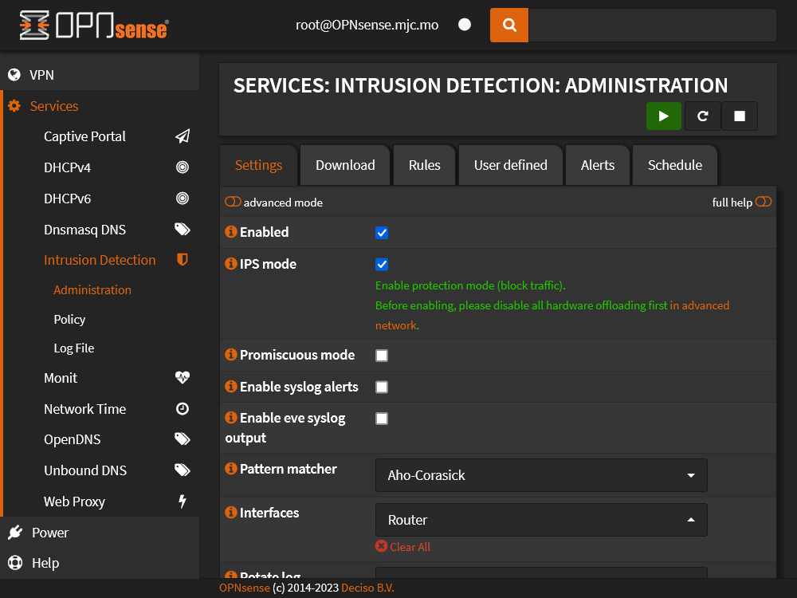
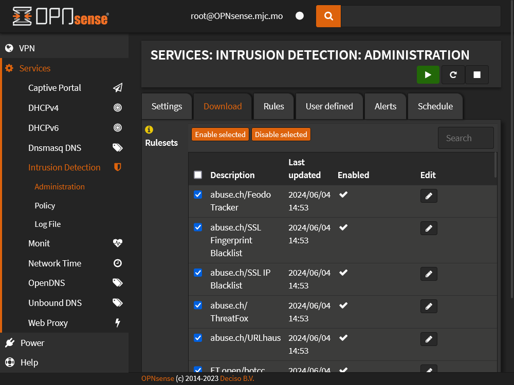
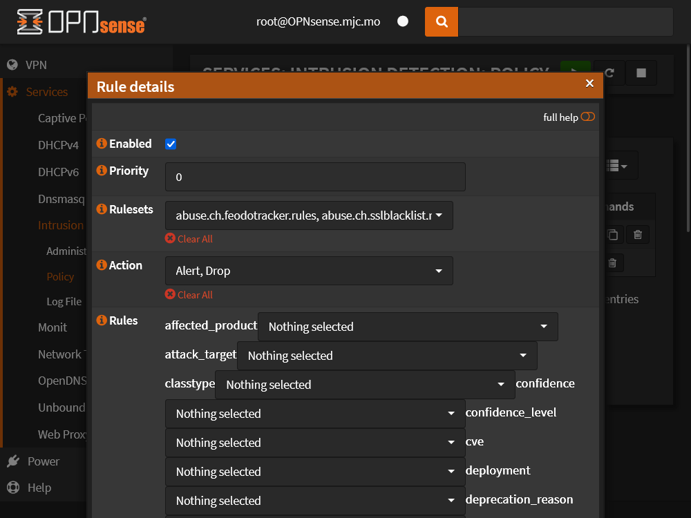

# Enable IPS on OPNsense



Select **Enabled**

**IPS mode**:

- ✅: IPS mode (Block traffic)
- 🟩: IDS mode

**Interfaces**: the selected interface will be checked, include ingress and egress



Click the **Download** tab, select the rule set, click **Enable selected**

Rule set reference:

- [ET rule set category description](https://tools.emergingthreats.net/docs/ETPro%20Rule%20Categories.pdf)

Click **Download & Update Rules**

**Rules** tab will show downloaded rules

:::note

OPNsense times must be correct (approximately), because download uses HTTPS

:::



Go to **Policy** page, click `+` to add policy

Select **Rulesets**

**Action**: the default action in rulesets match this will be used, usually select **Alert**, **Drop**

**Nothing selected**: match all

**New action**: if the rule is matched, this action will be used

## Testing IPS

- Enable rule set **OPNsense-App-detect/test**, and add the rule set to policy
- Open any EICAR test URL
  - http://malware.wicar.org/data/eicar.com
  - http://www.csm-testcenter.org/csm-eicar.txt
  
[Test Malware! - WICAR.org](https://www.wicar.org/test-malware.html)

```sh
curl http://malware.wicar.org/data/eicar.com
```

```text
X5O!P%@AP[4\PZX54(P^)7CC)7}$EICAR-STANDARD-ANTIVIRUS-TEST-FILE!$H+H*
```

:::note

If OPNsense is not proxy, OPNsense cannot decrypt and detect HTTPS content

:::
