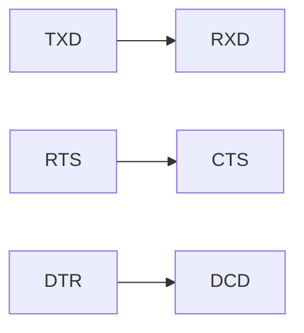

# RS-232

> Ref: [Wikipedia](https://en.wikipedia.org/wiki/RS-232)

RS-232 / COM port / Serial port

<!--truncate-->

## Connector

- DB-25
- DE-9 (AKA DB-9)
- Usually use DE-9
- DTE (male)
- DCE (female)

### DE-9

DE-9 is correct name, but usually name DB-9

> Ref: [D-subminiature](https://en.wikipedia.org/wiki/D-subminiature#DE-9)

## Pin

Pin | SIG | Name | DTE (male)
-|-|-|-
1 | DCD | Data Carrier Detect | in
2 | RXD | Receive Data | in
3 | TXD | Transmit Data | out
4 | DTR | Data Terminal Ready | out
5 | GND | Signal Ground | -
6 | DSR | Data Set Ready | in
7 | RTS | Request To Send | out
8 | CTS | Clear To Send | in
9 | RI | Ring Indicator | in

### Common usage

`RXD` `TXD` `GND`
