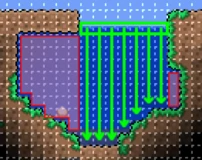
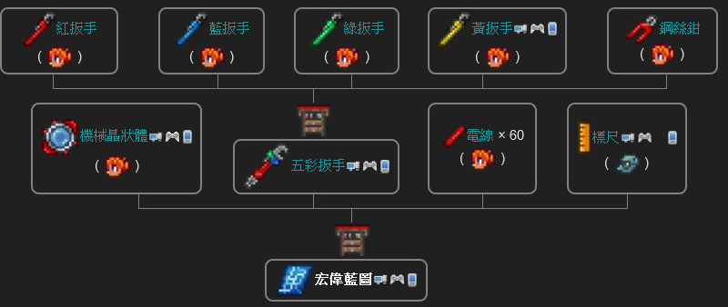

# Terraria

## Tips

- Cursor Color
  - Border: White
- 金字塔 有 獨有的 裝備寶箱
  - 金字塔 生成機率 &lt;50%，小地圖機率很低，中、大地圖機率 ~50%
- 用 [墜落之星](#) ×5 做 [魔力水晶](#)
- 鉤
  - 用 [鏈條](#) ×3 [爪鉤](#) ×1 去 [鐵砧](#) 做 [抓鉤](#)
- [向日葵](#) 可以防止附近腐化
- 雪原 有很多 [寶石](#)、[生命水晶](#)
- 雪原 和 地牢 在同一方向？
- 雪原 和 叢林 在相反方向？
- [哥布林數據儀](#)
  - 材料：
    - [金屬探測器](#)
      - 地下 [寧芙](#) 50% / 100% ( 專家模式 ) 機率掉落
- 晚上是 19:30 至 04:30
- [派對女孩](#) 在 開派對時，交談會得到 [蛋榚塊](#)

## 藥水

製作站：

- 放置的瓶子
- 煉藥桌

在 放置 的 [玻璃瓶](#) 或 [煉藥桌](#) 制作

### 再生藥水

每秒回復 2 生命，持續 8 分鐘

- 水瓶
- 太陽花
- 蘑菇

### 魔力再生藥水

魔力再生速度提升

- 水瓶
- 月光草
- 太陽花
- 墜落之星

### 鐵皮藥水

減少 4 / 6 ( 專家模式 ) / 8 ( 大師模式 ) 所受傷害，持續 5 分鐘

- 水瓶
- 太陽花
- 鐵礦

### 耐力藥水

減少 10% 所受傷害，持續 4 分鐘

- 水瓶
- 裝甲洞穴魚
- 閃耀根

### 戰鬥藥水

敵人生成速度增加 100% ，持續 7 分鐘

- 水瓶
- 死亡草
- 腐肉 / 椎骨

### 黑曜石皮藥水

- 水瓶
- 火焰花
- 幌菊
- 黑曜石

## 晶塔

| 晶塔 | 生物群落 | ❤ | 😡 |
|-|-|-|-|
| 森林晶塔 | 森林 | 商人<br/>嚮導 | 染料商 |
| 雪原晶塔 | 雪原 | 機械師 | 軍火商<br/>護士<br/>酒館老闆 |
| 沙漠晶塔 | 沙漠 | 軍火商<br/>染料商 | 樹妖<br/>漁夫<br/>商人 |
| 洞穴晶塔 | 地下<br/>洞穴<br/>地獄 | 爆破專家<br/>哥布林工匠 | 機械師 |
| 海洋晶塔 | 海洋 | 漁夫 | 嚮導<br/>巫師<br/>爆破專家 |
| 叢林晶塔 | 叢林 | 樹妖<br/>巫醫​ | 哥布林工匠 |
| 神聖晶塔 | 神聖 | 護士<br/>巫師<br/>酒館老闆 | 巫醫​ |
| 蘑菇晶塔 | 發光蘑菇 | 松露人 |
| 萬能晶塔 | 任何 | 怪物圖鑑完成時<br/>由動物學家出售 |

## NPC

| NPC | 💖 | ❤ | 😠 | 😡 |
|-|-|-|-|-|
| 商人 | - | 森林<br/>高爾夫球手<br/>護士 | 沙漠<br/>稅收官 | 漁夫 |
| 嚮導 | - | 森林<br/>服裝商<br/>動物學家 | 海洋<br/>蒸汽朋克人 | 油漆工 |
| 染料商 | - | 沙漠<br/>軍火商<br/>油漆工 | 森林<br/>蒸汽朋克人 | 海盗 |
| 機械師 | 哥布林工匠 | 雪原<br/>機器俠 | 地下<br/>軍火商 | 服裝商 |
| 軍火商 | 護士 | 沙漠<br/>蒸汽朋克人 | 雪原<br/>高爾夫球手 | 爆破專家 |
| 護士 | 軍火商 | 神聖之地<br/>巫師 | 雪原<br/>派對女孩<br/>樹妖 | 動物學家 |
| 酒館老闆 | 爆破專家 | 神聖之地<br/>哥布林工匠 | 雪原<br/>嚮導 | 染料商 |
| 樹妖 | - | 叢林<br/>巫醫<br/>松露人 | 沙漠<br/>漁夫 | 高爾夫球手 |
| 漁夫 | - | 海洋<br/>派對女孩<br/>爆破專家<br/>稅收官 | 沙漠 | 酒館老闆 |
| 爆破專家 | 酒館老闆 | 地下<br/>機械師 | 海洋<br/>哥布林工匠<br/>軍火商 | - |
| 哥布林工匠 | 機械師 | 地下<br/>染料商 | 叢林<br/>服裝商 | 髮型師 |
| 巫師 | 高爾夫球手 | 神聖之地<br/>商人 | 海洋<br/>巫醫 | 機器俠 |
| 巫醫​ | - | 叢林<br/>樹妖<br/>嚮導 | 神聖之地<br/>護士 | 松露人 |
| 松露人 | 嚮導 | 發光蘑菇<br/>樹妖 | 服裝商 | 巫醫 |
| 派對女孩 | 巫師<br/>動物學家 | 神聖之地<br/>髮型師 | 地下<br/>商人 | 稅收官 |
| 全部 |  | 公主 |  |

## 生物群落

### 發光蘑菇

- 最少 101 格 發光蘑菇 相關的

### 沙漠

- 最少 1500 格 沙漠 相關的

## 安全屋

```
--+-----+--
  |  O  |
    /|\
    / \
```

## 礦石

|  |  |
|:-:|:-:|
| 銅 | 錫 |
| 鐵 | 鉛 |
| 銀 | 鎢 |
| 金 | 鉑金 |

## 農場

> [Reference](https://terraria.fandom.com/zh/wiki/%E6%8C%87%E5%8D%97:%E5%88%B7%E8%B5%84%E6%BA%90)

- 樹 與 樹 之間要有 3 格水平空間
  
  | 樹 | 需要垂直空間 |
  | - | -: |
  | 樹 | 16 格 |
  | 叢林樹 | 24 格 |
  | 棕櫚樹 | 30 格 |
  | 寶石樹 | 11~16 格 |

- 泥塊 下放置 非泥塊（木材、平台），可以防止 [藤蔓](#) 生長
- 柵欄 可以阻擋敵人，但 [蘑菇](#) 可以生長

### 寶石果

- 用 [寶石](#) [橡實](#) 做 [寶石果](#)
- 到 地下層 ( 深度 0 以下 ) 石塊 種 [寶石樹](#)

## 地層

| 地層 | 高度 |
| :-: | -: |
| 太空 |
| 地表 | 0 ft |
| 地下 | ≈ 10% |
| 洞穴 |
| 地獄 | ≈ 300ft |

## Guide

## 房屋

> [Ref](https://terraria.fandom.com/zh/wiki/%E6%88%BF%E5%B1%8B)

- ≥ 60 格（包括牆）
- 入口：門 / 機關門 / 平台
- 光源：火把 / 燈
- 平坦表面：工作台、桌
- 舒適性：椅子、床
- 背景牆
- 最少有 1 格 實心地板（非平台）給 NPC 站立
  - 實心地板 不可與 兩側牆 或 開啟的門 相鄰
- 有 2×3 格的空間
  - 可以與 平坦 或 舒適性 物品重疊
  - 不能與 光源 重疊

## NPC 商人

- 條件：
  - 有 [空房](#房屋)
  - 有 50 銀
- 買 豬豬存錢罐

<hr/>

- 做 [仙人掌盔甲](#) [仙人掌劍](#)

## NPC 漁夫

*[Optional]*

- 去 海洋 （世界盡頭）找 漁夫
- 做 5 個 漁夫 任務
  - 取得 [兔兔](#) 坐騎
- 任務在每天 4:30 更新

釣魚



- 最少 300 格 [水](#) / 4001 格 [海洋](#) / 200 格 [蜂蜜](#)
- 小於 300 格 會有 漁力懲罰
- 玩家 不能在水中
- 平台 不算是覆蓋？
- 裝備 [優質釣魚線](#)，防止有 $\frac{1}{7}$ 機率斷線

## NPC 動物學家

- 條件：
  - 有 [空房](#房屋)
  - 怪物圖鑑 ≥ 10%
- 買 [松鼠鉤](#)

<hr/>

- 買 繩，去 地下
  - 撿 [炸彈](#) （壺 機率掉落）

## NPC 爆破專家

- 條件：
  - 物品欄有 [炸彈](#)
  - 商人 已入住
- 買 [炸彈](#) 去 地下 炸 礦石

## 血月

- 玩家 生命 ≥ 120
- 血腥殭屍 (0.5%) 和 滴滴怪 (1%) 機率掉落 [錢幣槽](#)

<hr/>

- 用 [石塊](#) ×20 [木材](#) ×4 [火把](#) ×3 去 [工作台](#) 做 [熔爐](#)
  - 用 [鐵礦](#) ×3 去 [熔爐](#) 做 [鐵錠](#)
  - 用 [鐵錠](#) ×5 去 [工作台](#) 做 [鐵砧](#)
    - 用 [鐵錠](#) 去 [鐵砧](#) 做 [鏈條](#)
- *[Optional]* 用 [金錠](#) ×10 [鏈條](#) 做 [金表](#)
- *[Optional]* 用 [鏈條](#) [木材](#) ×10 [鐵錠](#) ×2 去 [工作台](#) 做 [鋸木機](#)
  - 織布機 > 絲綢 > 床
- 做 [鐵鎬](#)
- 做 鐵/銀/金 盔甲
- *[Optional]* 找 [閃耀根](#)
  - 去 叢林 找 [月光草](#) （藍光）
  - …

## 史萊姆雨

- 條件：
  - 玩家 生命 ≥ 140
  - 玩家 防禦 ≥ 8

## 史萊姆王

- 手動 召喚：
  - 用 [金錠](#) ×5 [紅玉](#) ×1 去 [鐵砧](#) 做 [金冠](#)
  - 用 [金冠](#) ×1 [凝膠](#) ×20 去 [惡魔祭壇](#) 做 [史萊姆王冠](#)

## 克蘇魯之眼

- 條件：
  - 玩家 生命 ≥ 200
  - 玩家 防禦 ≥ 10
  - 4 個 NPC
- 手動 召喚：
  - 用 [晶狀體](#) ×6 去 [惡魔祭壇](#) 做 [可疑眼球](#)
- 用 [魔礦錠](#) ×10 去 [鐵砧](#) 做 [魔光劍](#)

## 哥布林軍隊

- 條件：
  - 摧毀了至少一個 [暗影珠](#)
  - 玩家 生命 ≥ 200
- 手動 召喚：
  - 去 世界 左右兩側 $\frac{1}{6}$，擊殺 哥布林偵察兵，會掉落 [破布](#)
    - 帶 [戰鬥藥水](#戰鬥藥水) 和 [水蠟燭](#地牢) 可增加敵人生成速度
  - 用 [破布](#) ×10 [木材](#) ×5 去 [織布機](#) 做 [哥布林戰旗](#)

## NPC 哥布林工匠

- 條件：
  - 哥布林軍隊 被 擊敗
  - 去 洞穴 / 地牢 找 NPC 哥布林工匠
- 買 [火箭靴](#)
- 買 [工匠作坊](#)
- 做 [幽靈靴](#)
  - @ [工匠作坊](#)
  - 材料：
    - [火箭靴](#)
    - [赫爾墨斯靴](#) / [疾風雪靴](#) / [航魚靴](#) / [沙丘行者靴](#)
- 做 [全球定位系統](#)
  - @ [工匠作坊](#)
  - 材料：
    - [金表](#) 
      - @ [桌子](#) 和 [椅子](#)
      - 材料：
        - [金錠](#) ×10
        - [鏈條](#)
    - [深度計](#)
      - [蝙蝠](#) 1% 機率掉落
    - [羅盤](#)

## 世界吞噬怪
## 克蘇魯之腦

| 腐化 | 猩紅 |
|:-:|:-:|
| 腐化之地 | 猩紅之地 |
| 暗影珠 | 猩紅之心 |
| 惡魔祭壇 | 猩紅祭壇 |
| 腐肉 | 椎骨 |
| 魔粉 | 毒粉 |
| 蠕蟲誘餌 | 血腥脊椎 |
| 魔礦 | 猩紅礦 |
| 暗影盔甲 ( 近戰 移動速度 ) | 猩紅盔甲 ( 傷害 生命恢復 ) |
| 魔刺 | 猩紅魔杖 |
| 暗影鱗片 | 組織樣本 |
| 魔光劍 | 血腥屠刀 |

- 去 [腐化之地](#)
- 用 [炸彈](#) / [金鎬](#) 砸 [暗影珠](#) ×3 召喚 [世界吞噬怪](#)

- 召喚：
  - 用 [魔菇](#) 去 [放置的瓶子](#) 做 [魔粉](#)
  - 用 [腐肉](#) ×15 [魔粉](#) ×30 去 [惡魔祭壇](#) 做 [蠕蟲誘餌](#)
  - 用 [蠕蟲誘餌](#) 召喚 [世界吞噬怪](#世界吞噬怪)
- 用 [魔礦](#) ×3 去 [熔爐](#) 做 [魔礦錠](#)
- 用 [暗影鱗片](#) ×45 [魔礦錠](#) ×60 去 [鐵砧](#) 做 [暗影盔甲](#)
- 用 [暗影鱗片](#) ×6 [魔礦錠](#) ×12 去 [鐵砧](#) 做 [夢魘鎬](#)
- [暗影盔甲](#) = [遠古暗影盔甲](#)
- [暗影珠](#) 20% 機率掉落 [魔刺](#)

## NPC 酒館老闆

- 條件：
  - 擊殺 [世界吞噬怪](#世界吞噬怪) 後
  - 可在任何地層出現

## 隕石

*Optional*

- 用 [坐騎](#) 站著 [隕石](#)，不會受到傷害
- 用 [隕石](#) ×3 去 [熔爐](#) 做 [隕石錠](#)
- 用 [隕石錠](#) ×45 去 [鐵砧](#) 做 [流星盔甲](#) ( 魔法傷害 )
- 用 [隕石錠](#) ×20 去 [鐵砧](#) 做 [太空槍](#)

## 叢林

- 用 [叢林孢子](#) ×32 [毒刺](#) ×10 [藤蔓](#) ×2 去 [鐵砧](#) 做 [叢林盔甲](#) ( 魔法 )
- 用 [叢林孢子](#) ×12 [毒刺](#) ×12 去 [鐵砧](#) 做 [草劍](#)
- [叢林盔甲](#) = [遠古鈷盔甲](#)

## 蜂王

- 條件：
  - 在 [地下叢林](#) 裡的 [蜂巢](#) 摧毀 [幼蟲](#)

- 召喚：
  - [水](#) 和 [蜂蜜](#) 接觸變成 [蜂蜜塊](#)
  - 用 [玻璃瓶](#) 去 [蜂蜜](#) 做 [蜂蜜瓶](#)
  - 用 [蜂蜜塊](#) ×5 [毒刺](#) ×1 [蜂巢](#) ×5
[蜂蜜瓶](#) ×1 做 [憎惡之蜂](#)

- 用 [蜂蜡](#) ×14 去 [鐵砧](#) 做 [黄蜂法杖](#)
- 用 [蜂蜡](#) ×30 去 [鐵砧](#) 做 [蜜蜂盔甲](#) ( 召喚數量 召喚傷害 )

## 骷髏王

- 晚上 去 地牢 和 NPC 老人 聊聊

## 地牢

- 撿走所有 [水蠟燭](#)
- 擊殺所有 [史萊姆](#)，會掉 [鑰匙](#)
- 找到 [機械師](#) 後，先買 [鋼絲鉗](#)
  - 去 [工匠作坊](#) 做 [宏偉藍圖](#)
    
    
- [鎖住的金箱](#) 有 [村正大刀](#)
- 用 [骨頭](#) ×150 [蛛網](#) ×135 去 [工作台](#) 做 [死靈盔甲](#) ( 遠程傷害 )
- 用 [骨頭](#) ×90 [蛛網](#) ×55 去 [工作台](#) 做 [脊柱骨鞭](#)
- 用 [骨頭](#) ×30 [叢林孢子](#) ×15 [暗影鱗片](#) ×30 去 [惡魔祭壇](#) 做 [虛空袋](#)
- 用 [骨頭](#) ×15 [叢林孢子](#) ×8 [暗影鱗片](#) ×15 去 [惡魔祭壇](#) 做 [虛空保險庫](#)

```
graph TD
    機械師 -->
    紅扳手 & 藍扳手 & 綠扳手 & 黃扳手 & 鋼絲鉗
    --- 工匠作坊1[工匠作坊] --> 五彩扳手
    機械師1["機械師"] --> 機械晶狀體 & 電線["電線 ×60"]
    哥布林工匠 --> 標尺
    機械晶狀體 & 五彩扳手 & 電線 & 標尺
    --- 工匠作坊2[工匠作坊] --> 宏偉藍圖
```

<hr/>

## 地獄

- 帶 [暗影鑰匙](#)
- [水](#) 和 [熔岩](#) 接觸變成 [黑曜石](#)
- 做 [黑曜石皮藥水](#黑曜石皮藥水)
- [地獄熔爐](#) 可取代 [熔爐](#)
- 用 [黑曜石](#) [獄石](#) ×3 去 [地獄熔爐](#) 做 [獄石錠](#)
- 用 [獄石錠](#) ×45 去 [鐵砧](#) 做 [熔岩盔甲](#) ( 近戰傷害 )
- 用 [獄石錠](#) ×20 去 [鐵砧](#) 做 [熔岩鎬](#)
- 用 [獄石錠](#) ×15 去 [鐵砧](#) 做 [熔岩錘斧](#)
- 用 [獄石錠](#) ×17 去 [鐵砧](#) 做 [小鬼法杖](#)
- 用 [獄石錠](#) ×15 [蟲網](#) 去 [地獄熔爐](#) 做 [防熔岩蟲網](#)
- 用 [獄石錠](#) ×20 去 [鐵砧](#) 做 [熾焰巨劍](#)
- 用 [魔光劍](#) [村正大刀](#) [草劍](#) [熾焰巨劍](#) 去 [惡魔祭壇](#) 做 [永夜刃](#)
- [惡魔](#) 有 $\frac{1}{35}$ 機率掉落 [惡魔鋤刀](#)

## 血肉牆

- [種植盆](#) 當 [平台](#) ( [熔岩](#) 不會催毁 [種植盆](#) )
- 推薦 [惡魔鋤刀](#)

## NPC 稅收官

- 擊殺 [血肉牆](#血肉牆) 後，用 [淨化粉](#) 把附近的 [痛苦亡魂](#) 轉化成 [稅收官](#)

## 困難模式

## NPC 松露人

條件：

- 困難模式
- 有 [空房](#房屋) 在 自己建立的 [地表](#地層) [發光蘑菇 生物群落](#發光蘑菇)

## 礦石（困難模式）

|  |  |
|:-:|:-:|
| 鈀金 | 鈷 |
| 山銅 | 秘銀 |
| 精金 | 鈦金 |

<hr/>

- 用 [神錘](#) 摧毀 多個 [惡魔祭壇](#)
- 用 [鈷礦](#) ×3 到 [熔爐](#) 做 [鈷錠](#)
- 用 [鈷錠](#) ×15 到 [鐵砧](#) 做 [鈷鎬](#)
- 用 [鈷鎬](#) 挖 [秘銀礦](#)
- 用 [秘銀礦](#) ×4 到 [熔爐](#) 做 [秘銀錠](#)
- 用 [秘銀錠](#) ×10 到 [鐵砧](#) 做 [秘銀砧](#)
- 用 [秘銀錠](#) ×15 到 [秘銀砧](#) 做 [秘銀鎬](#)
- 用 [秘銀鎬](#) 挖 [精金礦](#)
  - [精金礦](#) 只在 高度 50% 以下 生成
- 用 [精金礦](#) ×30 [地獄熔爐](#) 到 [秘銀砧](#) 做 [精金熔爐](#)
- 用 [精金礦](#) ×4 去 [精金熔爐](#) 做 [精金錠](#)
- 用 [精金錠](#) ×54 去 [秘銀砧](#) 做 [精金盔甲](#)

## 鳥妖之翼

- @ [秘銀砧](#)
- 材料：
  - [飛翔之魂](#) ×20
    - 在 太空 [飛龍](#) 100% 掉落
  - [巨型鳥妖之羽](#)
    - 在 太空 [鳥妖](#) 0.5% 掉落

## 機械 Boss

## 毀滅者

手動 召喚：
- 做 [機械蠕蟲](#)
  - @ [秘銀砧](#)
  - 材料：
    - [腐肉](#) ×6
    - [暗影之魂](#) ×6
    - [鐵錠](#) ×5
- 在 晚上 使用 [機械蠕蟲](#)

## 雙子魔眼

手動 召喚：

- 做 [機械魔眼](#)
  - @ [秘銀砧](#)
  - 材料：
    - [晶狀體](#) ×3
    - [光明之魂](#) ×6
    - [鐵錠](#) ×5
- 在 晚上 使用 [機械魔眼](#)

## 機械骷髏王

手動 召喚：
- 做 [機械骷髏頭](#)
  - @ [秘銀砧](#)
  - 材料：
    - [骨頭](#) ×30
    - [光明之魂](#) ×6
    - [暗影之魂](#) ×3
    - [鐵錠](#) ×5
- 在 晚上 使用 [機械骷髏頭](#)

## 神聖盔甲

用 [神聖錠](#) ×54 做 [神聖盔甲](#)

## 鎬斧

- @ [秘銀砧](#)
- 材料：
  - [神聖錠](#) ×18
  - [恐懼之魂](#)
  - [力量之魂](#)
  - [視域之魂](#)

## 原版永夜刃

- @ [秘銀砧](#)
- 材料：
  - [永夜刃](#)
  - [恐懼之魂](#) ×20
  - [力量之魂](#) ×20
  - [視域之魂](#) ×20

## 葉綠礦

去 [叢林](#) 挖 [葉綠礦](#)

用 [葉綠礦](#) ×5 去 [精金熔爐](#) 做 [葉綠錠](#)

## 海龜盔甲

- @ [秘銀砧](#)
- 材料：
  - [葉綠錠](#) ×54
  - [海龜殼](#) ×3

## 世紀之花

條件：
- 擊殺 3個 機械 Boss
- 在 地下叢林 砸 [世紀之花球莖](#)

掉落：
- [神廟鑰匙](#) 100%
- [爆裂藤蔓](#) $\frac{1}{7}$
- [胡蜂槍](#) $\frac{1}{7}$
- [花之力](#) $\frac{1}{7}$
- [種子彎刀](#) $\frac{1}{7}$
- [矮人法杖](#) 25%
- [吉他斧](#) 2%

## 南瓜月

*Optional*

在 19:30 - 04:30 使用 [南瓜月勳章](#南瓜月勳章)

### 南瓜月勳章

- @ [秘銀砧](#)
- 材料：
  - [南瓜](#) ×30
    - 去 [樹妖](#樹妖) 買 [南瓜子](#)
    - 種在 地表 以上的 草 或 神聖草
  - [靈氣](#) ×5
  - [神聖錠](#機械%20Boss) ×10

### 南瓜王

掉落：
- [無頭騎士劍](#) $\frac{1}{8}$

## 石巨人

拿 [神廟鑰匙](#) 去開 [叢林蜥蜴神廟](#) 的 門，在 [叢林蜥蜴祭壇](#) 使用 [叢林蜥蜴電池](#)

掉落：
- [甲蟲外殼](#) 100%
- [鋸刃鎬](#) 25%
- [瘋狂飛斧](#) $\frac{1}{7}$
- [太陽石](#) $\frac{1}{7}$
- [石巨人之眼](#) $\frac{1}{7}$

## 甲蟲盔甲

- @ [秘銀砧](#)
- 材料：
  - [海龜盔甲](#海龜盔甲)
  - [甲蟲外殼](#) ×18

## 光之女皇

*Optional*

條件：
- 擊殺 [世紀之花](#)
- 擊殺 [神聖之地](#) 的小動物 [七彩草蛉](#)
- [七彩草蛉](#) 在 7:30 PM - 12:00 AM 生成

## 拜月教邪教徒

條件：

- 擊殺 [石巨人](#石巨人)
- 擊殺 [地牢](#地牢) 入口的 邪教徒

掉落：

- [遠古操縱機](#拜月教邪教徒) 100%

## 月亮事件

條件：

- 擊殺 [拜月教邪教徒](#拜月教邪教徒) 生成 4個 [天界柱](#天界柱)
  - [日耀柱](#)
  - [星旋柱](#)
  - [星雲柱](#)
  - [星塵柱](#)

### 天界柱

- 擊殺 [天界柱](#) 的敵人會消除 [天界柱](#) 的護盾
- 消除護盾後，擊殺 [天界柱](#)

### 日耀柱

- 用 [日耀碎片](#) ×18 去 [遠古操縱機](#拜月教邪教徒) 做 [日耀噴發劍](#)
- 用 [日耀碎片](#) ×18 去 [遠古操縱機](#拜月教邪教徒) 做 [破曉之光](#)

### 星旋柱

### 星雲柱

- 用 [星雲碎片](#) ×18 去 [遠古操縱機](#拜月教邪教徒) 做 [星雲奧秘](#)
- 用 [星雲碎片](#) ×18 去 [遠古操縱機](#拜月教邪教徒) 做 [星雲烈焰](#)

### 星塵柱

- 用 [星塵碎片](#) ×18 去 [遠古操縱機](#拜月教邪教徒) 做 [星塵之龍法杖](#)

## 月亮領主

手動 召喚：
- 使用 [天界符](#)
  - @ [遠古操縱機](#拜月教邪教徒)
  - 材料：
    - [日耀碎片](#) ×20
    - [星旋碎片](#) ×20
    - [星雲碎片](#) ×20
    - [星塵碎片](#) ×20

掉落：

- [傳送槍](#) 100%
- [夜明礦](#) 100%
- [彩虹貓之刃](#) $\frac{1}{9}$
- [狂星之怒](#) $\frac{1}{9}$
- [終極稜鏡](#) $\frac{1}{9}$
- [月耀](#) $\frac{1}{9}$
- [七彩水晶法杖](#) $\frac{1}{9}$
- [月亮傳送門法杖](#) $\frac{1}{9}$

### 夜明錠

- 用 [夜明礦](#) ×4 去 [遠古操縱機](#) 做 [夜明錠](#)

### 耀斑盔甲

- @ [遠古操縱機](#)
- 材料：
  - [夜明錠](#夜明錠) ×36
  - [日耀碎片](#日耀柱) ×45
