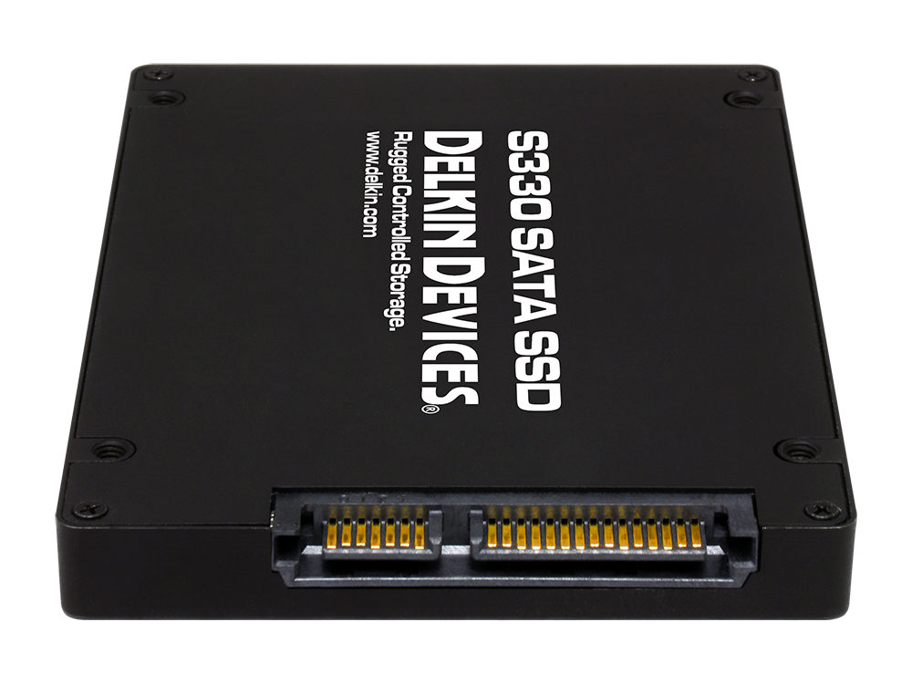
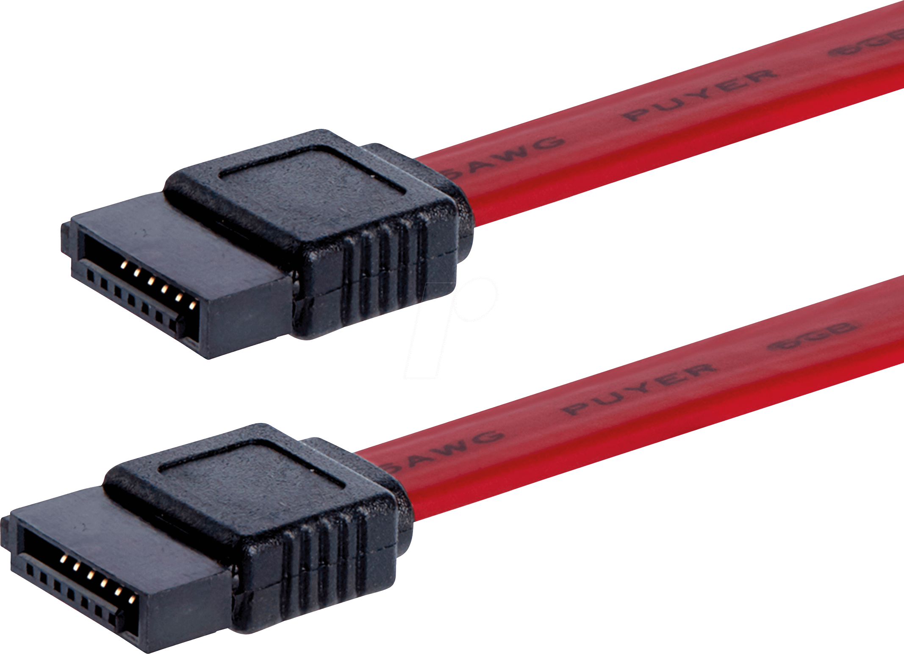
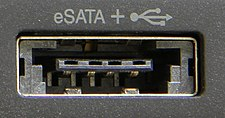
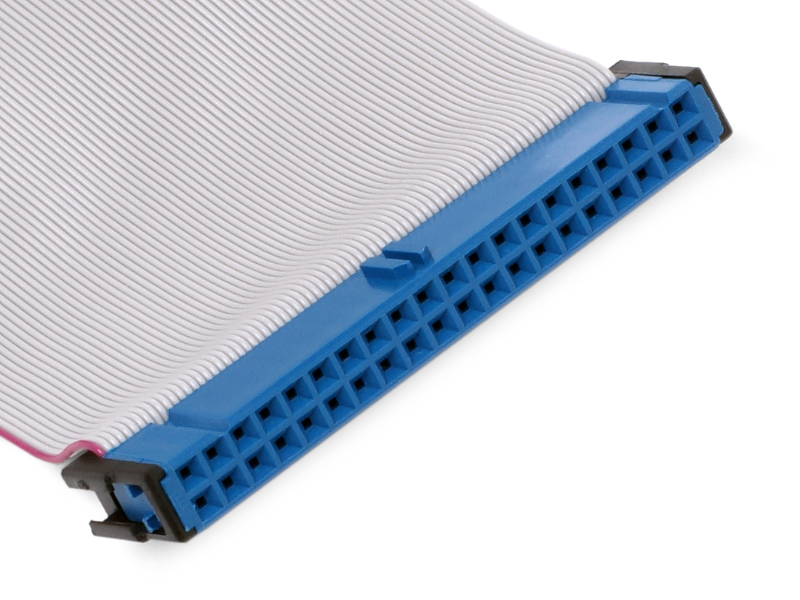
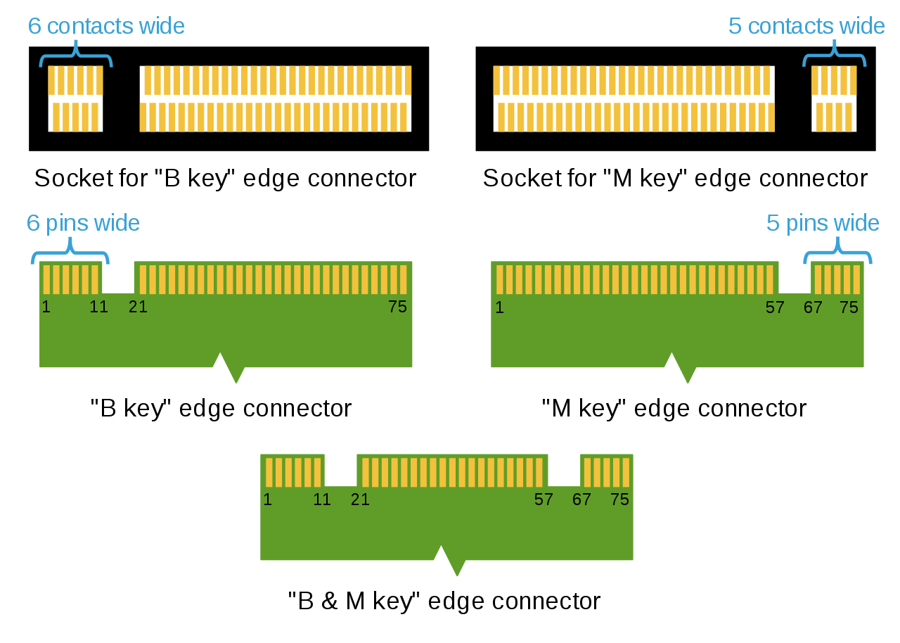

# Storage

## SATA

Serial ATA / Serial Advanced Technology Attachment




| SATA | Speed |
|-|-|
| SATA 3.0 | 600MB/s |
| SATA 2.0 | 300MB/s |
| SATA 1.0 | 150MB/s |

### eSATA

External SATA

- **Uncommon**



### mSATA

mini-SATA

- **Obsolete**
- 外型與 Mini PCI-E 完全相同，但不相容
- Use Mini PCI-E layout and connector, but not compatible
- Usually use in laptop
- Replaced by M.2

## PATA

Parallel ATA / IDE

- **Obsolete**



## M.2

AKA NGFF (Next Generation Form Factor)

- Replace mSATA
- M.2 provide PCIe x4, SATA 3.0, USB 3.0 computer bus
- Support NVMe
- If connect SATA SSD to NVMe M.2, that will not work

> Ref: [如何区分 M.2 卡之间的差异](https://www.dell.com/support/kbdoc/zh-cn/000144170/how-to-distinguish-the-differences-between-m-2-cards)

| Key | Size | Interface | Common use |
|-|-|-|-|
| A | 1630, 2230, 3030 | PCIe x2 / USB 2.0 / I2C / Display Port (DP) x4 | WiFi / BlueTooth / Cellular |
| B | 2230, 2242, 2260, 2280, 3042, 22110 | PCle x2 / USB 2.0 / USB 3.0 / Audio / PCM / IUM / SSIC / I2C | SATA / PCIe x2 / SSD |
| E | 1630, 2230, 3030 | PCIe x2 / USB 2.0 / I2C / SDIO / UART / PCM | WiFi / BlueTooth / Cellular |
| M | 2230, 2242, 2260, 2280, 22110 | PCIe x4 / SATA | PCIe x4 / SSD (NVMe) |
| B+M |  |  | SATA SSD |

### M.2 Key



### M.2 size

| | Length (mm) | Popular |
|-|-|-|
| Width | 12, 16, 22, 30 | 22 |
| Length | 16, 26, 30, 38, 42, 60, 80, 110 | 30, 42, 60, 80, 110 |

Size code

```plain
<width><length>

2230
2242
2280
...
```

## NVMe

NVM Express / Non-Volatile Memory Express

- Interface specification for NVM
- Replace SATA for NVM
- NVMe SSD has many form factors / interface:
  - M.2
    - Most popular
  - AIC (add-in card), PCIe
  - U.2
  - U.3
