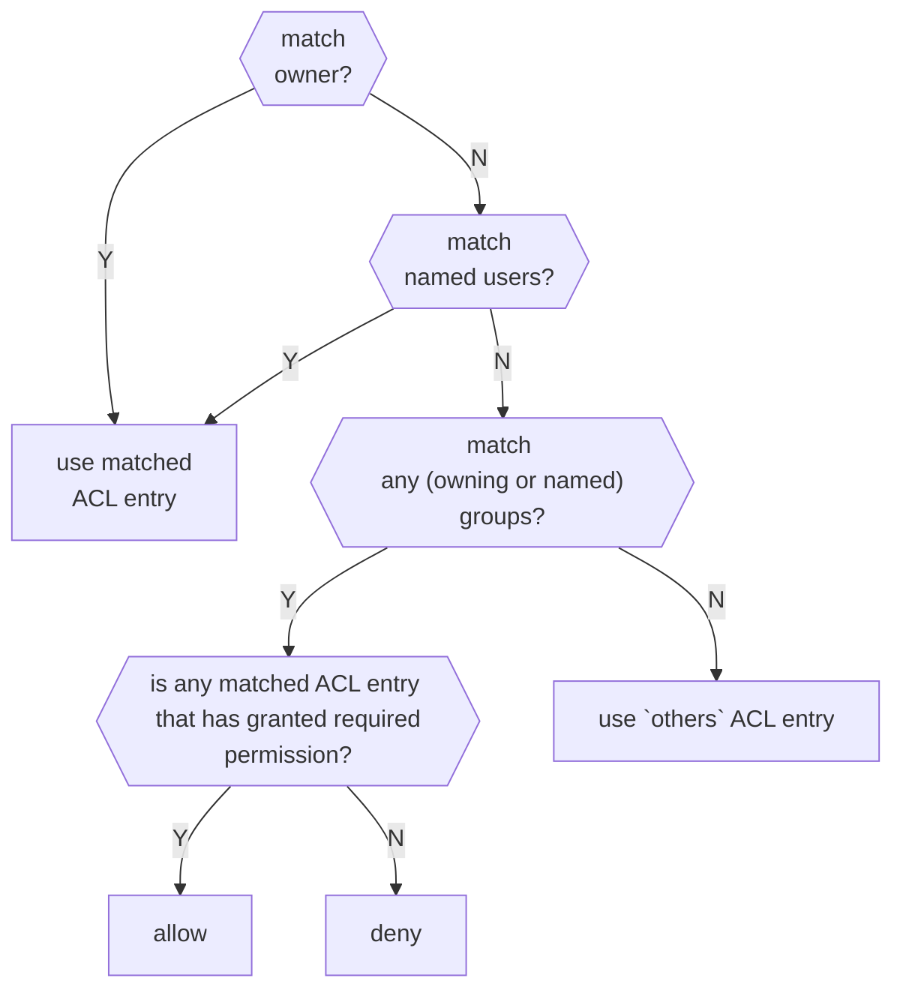

# Linux ACL

Access Control List

- Directory has default ACL, the ACL is applied to the file and directory created in that directory

## ACL order

> Ref: [POSIX Access Control Lists on Linux](acl.pdf)

First matched entry is used

- owner
- named users
- (owning or named) groups
- others



```sh
id admin

uid=1000(admin) gid=1000(admin) groups=1000(admin),1001(user)
```

```sh
id user

uid=1001(user) gid=1001(user) groups=1001(user)
```

```sh
getfacl file

# file: file
# owner: root
# group: root
user::rw-
group::r--
group:user:---
group:admin:r--
mask::r--
other::---
```

| User | Read `file` |
|-|-|
| `admin` | allow |
| `user` | deny |

`admin` is in 2 groups `admin` and `user`, `user` group is deny access `file`, but `admin` is allow, so `admin` still allow access.

## Mask

> Ref: [ACL Mask Value in Linux](https://linuxdatahub.com/masks-in-acl-linux-explained-with-examples-access-control-lists-mask/)

> Ref: `man setfacl`

- Masks are the highest permission allowed for user / group
- `setfacl` auto create mask entry (union all ACL entries) by default, unless option `-n` is set
- Masks only apply to extended ACL (`setfacl`), not apply to minimal ACL

```js
function effective_permission(mask, acl_entry) {
    return mask & acl_entry;
}

function is_granted(user, operation, acl) {
    return 
        operation & 
        effective_permission(mask(acl) & matched_entry(user, acl))
        > 0;
}
```
