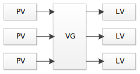

# LVM

Logical Volume Management

> [Tutorial](https://www.digitalocean.com/community/tutorials/an-introduction-to-lvm-concepts-terminology-and-operations)

> [Tutorial](https://www.digitalocean.com/community/tutorials/how-to-use-lvm-to-manage-storage-devices-on-ubuntu-16-04)

## Config file

```
/etc/lvm/lvm.conf
```

| Abbreviation | Name |
| - | - |
| PV | Physical Volume |
| VG | Volume Group |
| LV | Logical Volume |



## Scan for all available devices for LVM

```bash
lvmdiskscan
```

```bash
pvscan
```

## Change partition type ID to LVM

*Optional*

```bash
gdisk <device>

Command (? for help): t
Partition number (1-X): <partition>
Hex code or GUID (L to show codes, Enter = 8300): 8e00
Command (? for help): w
```

```bash
fdisk <device>

Command (m for help): t
Partition type (type L to list all types): L
Partition type (type L to list all types): <Linux LVM type ID>
Command (m for help): w
```

## PV (Physical Volume)

### Create PV

```bash
# <device> = <disk> | <partition>
pvcreate <device>[ ...]
```

### Remove PV

```bash
pvmove <PV>
vgreduce <VG> <PV>
pvremove <PV>
```

### Show PV information

```bash
pvs
```

```bash
pvdisplay
```

## VG (Volume Group)

### Create VG

```bash
vgcreate <VG name> <PV> ...
```

### Add PV to VG

```bash
vgextend <VG name> <PV> ...
```

### Remove VG

```bash
vgremove <VG name>
```

### Show VG information

```bash
vgs
```

```bash
vgdisplay
```

## LV (Logical Volume)

### Create LV

```bash
lvcreate 
    [
        -L <size>[K|M|G|T|P|E] |
        -l <percent>[%{VG|FREE}]
    ]
    –type { linear | raid1 | raid5 | raid6 }
    -n <LV name>
    <VG name>
```

### Show LV information

```bash
lvs
```

```bash
lvdisplay
```

### Remove LV

```bash
lvremove <LV>
```

### Resize LV

```bash
lvresize 
    {
        { -L | --size } {+|-}<size>[K|M|G|T|P|E] |
        { -l | --extends } {+|-}<percent>[%{VG|FREE}]
    }
    # Auto resize2fs
    [ -r | --resizefs ]
    <LV>
```

### Extent LV

`lvextend <size>` = `lvresize +<size>`

### Reduce LV

`lvreduce <size>` = `lvresize -<size>`

- Unmount LV
  ```bash
  umount <LV>
  ```
- Resize LV
  ```bash
  lvresize 
    -L [-]<size>[K|M|G|T|P|E]
    --resizefs
    <LV>
  ```

  - `--resizefs` is similar to do the following
    - Check file system
      ```bash
      fsck -f <LV>
      ```
    - Resize file system
      ```bash
      resize2fs <LV> <size>[s|K|M|G]
      ```

## Troubleshooting

### Device `<device>` excluded by a filter.

```bash
pvcreate -vvv <device> |& grep <device>
```

### Skipping: Partition table signature found

```bash
# Wipe all magic strings (BE CAREFUL!)
wipefs --all <device>
```
