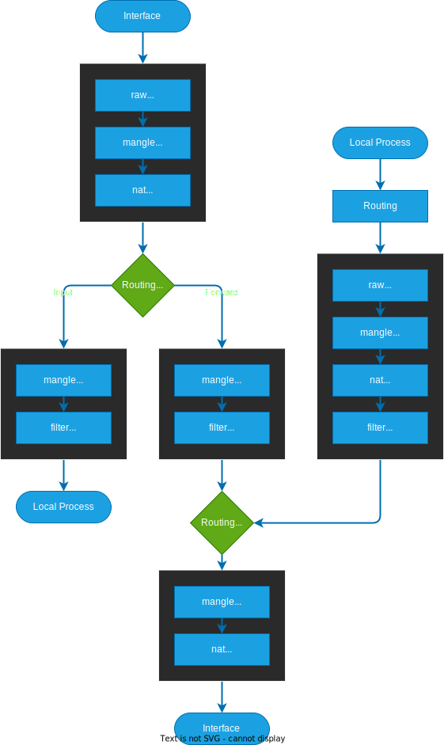

# iptables

> Ref: [Arch Linux iptables](https://wiki.archlinux.org/index.php/iptables)

| Description | Command |
| - | - |
| List rules | `iptables [--line-numbers] -L [<chain>]` |
| List rules with command syntax | `iptables -S [<chain>]` |
| Dump iptables to file | `iptables-save > <file>` |
| Restore iptables from file | `iptables-restore < <file>` |
| Save iptables (Red Hat \<= 6) | `service iptables save` |
| Create new chain (User-defined) | `iptables -N <chain>` |

## Flow

|  |  |
| - | - |
| Chains | `INPUT` / `OUTPUT` / `FORWARD` / `PREROUTING` / `POSTROUTING` |
| Tables | `raw` / `filter` / `nat` / `mangle` / `security` (Default is `filter`) |
| Targets | `ACCEPT` / `DROP` / `QUEUE` / `RETURN` / `REJECT` / `LOG` |

> [Ref](https://www.netfilter.org/documentation/HOWTO/packet-filtering-HOWTO-6.html)

:::info

- If any chain says `DROP`, it is killed there
- If chain says `ACCEPT`, it continue process
- User-defined chains can not have a default policy
- If no rule is matched in a User-defined chain, the default behaviour is to jump back to the originating chain

:::

> Ref: [iptables Processing Flowchart](https://stuffphilwrites.com/2014/09/iptables-processing-flowchart/)



## Policy

Policy = Default target

```bash
iptables -P <chain> <target>
```

## Rule

> Ref: [netfilter documentation](https://www.netfilter.org/documentation/HOWTO/packet-filtering-HOWTO-7.html)

| Option | Description |
| - | - |
| `-A` | Append rule to chain |
| `-I` | Insert rule to `rule number` position |
| `-D` | Delete rule `rule number` |
| `-p` | Protocol |
| Address | `10.0.0.1`, `0.0.0.0/0`, `10.0.0.0/24` |
| `!` | Not |

```bash
iptables 
    { -A <chain> | -I <chain> [rule number] | -D <chain> [rule number] }
    [[!] -i <interface>]
    [[!] -o <interface>]
    [[!] -s <src IP address>[/<prefix length>]]
    [[!] -d <dest IP address>[/<prefix length>]]
    [[!] -p {icmp|tcp|udp}]
    [[!] --sport <src port>[,...]]
    [[!] --dport <dest port>[,...]]
    -j <target>
```

## Extension

> Ref: [iptables-extensions](http://ipset.netfilter.org/iptables-extensions.man.html)

```bash
iptables <rule>
    [-m state [!] --state { NEW | ESTABLISHED | RELATED }]
    [-m conntrack 
        [[!] --ctstate { INVALID | NEW | ESTABLISHED | RELATED | UNTRACKED | SNAT | DNAT }]
    ]
    -j <target>
```

## Redirect input to other port

> Ref: [How To Mangle The Packets](https://www.netfilter.org/documentation/HOWTO/NAT-HOWTO-6.html)

```bash
iptables -t nat -A PREROUTING [-i <interface>] -p tcp --dport <from port> -j REDIRECT --to-port <to port>
```

## Masquerading

> Ref: [Masquerading](https://www.netfilter.org/documentation/HOWTO/NAT-HOWTO-6.html)

Source NAT

Use the address of the interface the packet is going out as source address

```bash
iptables -t nat -A POSTROUTING -o <interface> -j MASQUERADE
```

## Rule

Example rule

Allow all established packet

```sh
iptables -A INPUT -m state --state ESTABLISHED,RELATED -j ACCEPT
```

Allow TCP port 22 (SSH) connect

```
sudo iptables -A INPUT -p tcp --dport 22 -m conntrack --ctstate NEW,ESTABLISHED -j ACCEPT
sudo iptables -A OUTPUT -p tcp --sport 22 -m conntrack --ctstate ESTABLISHED -j ACCEPT
```
