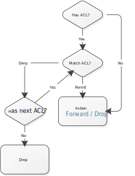

# ACL

Access Control List

## IP ACL

> [Reference](https://www.cisco.com/c/en/us/support/docs/security/ios-firewall/23602-confaccesslists.html)

- ACL default (No match) is `drop`
- Match if `(packet_ip & ~inverse_mask) == acl_ip`

Standard ACL

```
! <address> = { any | <IP address> <inverse mask> | host <IP> }

Switch(config)# ip access-list standard 
    { <ACL name> | <1-99> | <1300-1999> }

Switch(config-std-nacl)# [<sequence number>] 
    { permit | deny } 
    <source IP address>
```

Extended ACL

```
! <port> = { eq | neq | lt | gt } <port> | range <first port> <last port>

Switch(config)# ip access-list extended 
    { <ACL name> | <100-199> | <2000-2699> }

Switch(config-ext-nacl)# [<sequence number>] 
    { permit | deny } 
    { ip | udp | tcp } 
    <source IP address> [<source port>] 
    <destination IP address> [<destination port>]
```

Remove ACL

```
Switch(config-std-nacl)# no [<sequence number>]

Switch(config-ext-nacl)# no [<sequence number>] 
```

## Apply ACL to interface

```
Switch(config)# interface <interface>

! Not all interface can use { in | out }
Switch(config-if)# ip access-group { <ACL ID> | <ACL name> } { in | out }
```

## MAC ACL

ACL default (No match) is `drop`

```
Switch(config)# mac access-list extended <name>

! <MAC address> = { any | host <MAC address> | <MAC address> <MAC address mask> }
Switch(config-ext-macl)# { permit | deny } 
    <source MAC address> 
    <destination MAC address>
```

## VACL

VLAN ACL

- VACL can be applied to VLAN
- Filter packet that are bridged within a VLAN

> [Reference](https://www.cisco.com/c/en/us/td/docs/switches/lan/catalyst6500/ios/15-0SY/configuration/guide/15_0_sy_swcg/vlan_acls.html)



By default VACL `drop` (If no match and at least has 1 ACL)

```cisco
Switch(config)# vlan access-map <access-map name> [<sequence number>]
Switch(config-access-map)# action { forward | drop }
Switch(config-access-map)# match ip address <IP ACL>
Switch(config-access-map)# match mac address <MAC ACL>
Switch(config-access-map)# exit

Switch(config)# ...

Switch(config)# vlan filter <access-map name>
    vlan-list <VLAN list>
```

Block specify MAC address

> [Reference](https://www.cisco.com/c/en/us/support/docs/switches/catalyst-3550-series-switches/64844-mac-acl-block-arp.html)

```
! <MAC address> = { any | host <MAC address> | <MAC address> <MAC address mask> }

Switch(config)# mac access-list extended blacklist
Switch(config-ext-macl)# permit <source MAC address> <destination MAC address>
Switch(config-ext-macl)# exit

Switch(config)# vlan access-map <access-map name> 10
Switch(config-access-map)# action drop
Switch(config-access-map)# match mac address blacklist
Switch(config-access-map)# exit
Switch(config)# vlan access-map <access-map name> 20
Switch(config-access-map)# action forward
Switch(config-access-map)# exit

Switch(config)# vlan filter <access-map name>
    vlan-list <VLAN list>
```

Resequencing access-list entries

> [Reference](https://www.cisco.com/c/en/us/td/docs/ios-xml/ios/sec_data_acl/configuration/xe-3s/sec-data-acl-xe-3s-book/sec-acl-seq-num.html)

```
Switch(config)# ip access-list resequence <ACL ID> <starting sequence number> <increment>
```

List ACL

```
Switch# show ip access-lists
```
