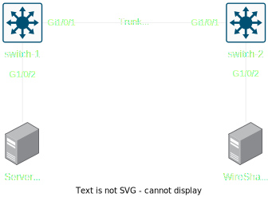

# SPAN

Switched Port Analyzer / Port Mirroing / Port Monitoring

> Ref: [SPAN](./span.pdf)

Copy (Mirror) source interface packet to destination interface

## Local SPAN

Mirror interface **Gi0/1** traffic to **Gi0/2**

```cisco
Switch(config)# monitor session 1 source interface Gi0/1
Switch(config)# monitor session 1 destination interface Gi0/2
```

Remove SPAN

```cisco
Switch(config)# no monitor session 1
```

### Monitor interface

Default: **both**

```
Switch(config)# monitor
    session <session number> 
    source interface <interface> 
    [ both | rx | tx ]
```

### Monitor all ports of specify VLAN

Default: **both**

```
Switch(config)# monitor
    session <session number> 
    source vlan <VLAN list> 
    [ both | rx | tx ]
```

### Monitor specific VLAN

For trunk port only

```
! <VLAN list> = <VLAN> [, <VLAN> ...]
! <VLAN> = <VLAN ID> | <VLAN ID> - <VLAN ID>
Switch(config)# monitor
    session <session number>
    filter <VLAN list>
```

### Mirror to specify interface

```
Switch(config)# monitor
    session <session number> 
    destination interface <interface>
```

### Remove monitor session

```
Switch(config)# no monitor
    session <session number>
```

## RSPAN

Remote SPAN



```cisco title="switch-1"
vlan 100
    name RSPAN
    remote-span

interface GigabitEthernet1/0/1
    description Trunk to switch-2
    switchport mode trunk
    switchport trunk allowed vlan 100

interface GigabitEthernet1/0/2
    description Server

monitor session 1 source interface Gi1/0/2
monitor session 1 destination remote vlan 100
```

```cisco title="switch-2"
vlan 100
    name RSPAN
    remote-span

interface GigabitEthernet1/0/2
    description WireShark

interface GigabitEthernet1/0/15
    description Trunk to switch-1
    switchport mode trunk
    switchport trunk allowed vlan 100

monitor session 1 source remote vlan 100
monitor session 1 destination interface Gi1/0/2
```

## Display SPAN status

```cisco
Switch# show monitor
```
