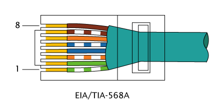
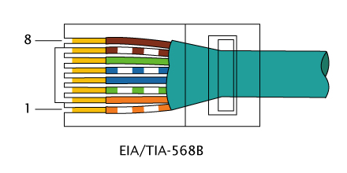
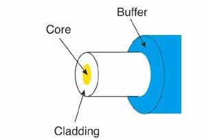
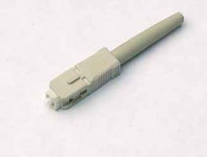
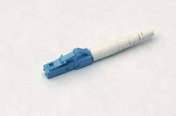

## Copper

> Ref: [Ethernet Media Standards and Distances](https://kb.wisc.edu/ns/page.php?id=7829)

### 10BASE-T

- Usually use in WOL (Wake On LAN)

|  |  |
| - | - |
| Speed | 10 Mb/s |
| Distance | 100m |
| Cable | Cat 5, Cat 5e, Cat 6 |
| Connector | 8P8C |

### 100BASE-TX

|  |  |
| - | - |
| Speed | 100 Mb/s |
| Distance | 100m |
| Cable | Cat 5, Cat 5e, Cat 6 |
| Connector | 8P8C |

### 1000BASE-T

|  |  |
| - | - |
| Speed | 1 Gb/s |
| Distance | 100m |
| Cable | Cat 5, Cat 5e, Cat 6 |
| Connector | 8P8C |

### 10GBASE-T

|  |  |
| - | - |
| Speed | 10 Gb/s |
| Distance | 55 m (Cat 6)  100 m (Cat 6a / Cat 7) |
| Cable | Cat 6, Cat 7 |
| Connector | 8P8C |

### Pinout

| Pin | 10BASE-T / 100BASE-TX  Signal ID | 1G / 10GBASE-T  Signal ID |
| - | - | - |
| 1 | TD+ | DA+ |
| 2 | TD- | DA- |
| 3 | RD+ | DB+ |
| 4 | - | DC+ |
| 5 | - | DC- |
| 6 | RD- | DB- |
| 7 | - | DD+ |
| 8 | - | DD- |

[8P8C](https://en.wikipedia.org/wiki/Modular_connector) (Referred to incorrect name: RJ45)

TIA/EIA-568A

TIA/EIA-568B

### PoE (Power over Ethernet)

#### 802.3af

> [Reference](https://en.wikipedia.org/wiki/Power_over_Ethernet)

| Pin | Data | Mode A | Mode B (Passive) |
| - | - | - | - |
| 1 | RX+ | DC+ | - |
| 2 | RX- | DC+ | - |
| 3 | TX+ | DC- | - |
| 4 | - | - | DC+ |
| 5 | - | - | DC+ |
| 6 | TX- | DC- | - |
| 7 | - | - | DC- |
| 8 | - | - | DC- |

## Auto MDI-X

Medium Dependent Interface, X = Crossover

> Ref: [Auto MDI-X](https://en.wikipedia.org/wiki/Medium-dependent_interface)

## Fiber

> Ref: [Cisco SFP Modules for Gigabit Ethernet Applications Data Sheet](https://www.cisco.com/c/en/us/products/collateral/interfaces-modules/gigabit-ethernet-gbic-sfp-modules/datasheet-c78-366584.html)

### 1000BASE‑LX/LH

|  |  |
| - | - |
| Fiber type | SMF / MMF with Mode Conditioning Patch Cable |
| Distance | SMF: 5 km, MMF: 550 m |
| Wavelength | 1,310 nm, 1,550 nm |
| Slot | GBIC, SFP |
| Connector | SC, LC |

### 1000BASE‑SX

|  |  |
| - | - |
| Fiber type | MMF |
| Distance | 550 m |
| Wavelength | 770 - 860 nm |
| Slot | GBIC, SFP |
| Connector | SC, LC |

### Optical Fiber

> Ref: [The FOA Reference For Fiber Optics - Optical Fiber](https://www.thefoa.org/tech/ref/basic/fiber.html)

### SMF (Single Mode Fiber)

> [FOA Reference](https://www.thefoa.org/tech/ref/basic/fiber.html)

> [ISO/IEC 11801](https://en.wikipedia.org/wiki/ISO/IEC_11801)

|  |  |
| - | - |
| OS (Optical Single-mode) | OS1, OS2 |
| Core diameter | 8 - 10.5 µm |
| Cladding diameter | 125 µm |

### MMF (Multi Mode Fiber)

> [Reference](https://en.wikipedia.org/wiki/Multi-mode_optical_fiber)

> [FOA Reference](https://www.thefoa.org/tech/ref/basic/fiber.html)

> [ISO/IEC 11801](https://en.wikipedia.org/wiki/ISO/IEC_11801)

|  |  |
| - | - |
| OM (Optical Multi-mode) | OM1 - OM5 |
| Core diameter | 50 – 100 µm, OM1 = 62.5 µm, OM2, OM3, OM4, OM5 = 50 µm |
| Cladding diameter | 125 µm |

### Connector

> [Reference](https://www.thefoa.org/tech/connID.htm)

| Name | Image |
| - | - |
| SC |  |
| LC |  |

## Slot

### QSFP28

100 Gigabit Ethernet

Channel: 4

Fiber Channel: 32 Gb/s

### QSFP+

40 Gigabit Ethernet

Channel: 4

Fiber Channel: 10 Gb/s

### QSFP (Quad Small Form-factor Pluggable)

4 Gigabit Ethernet

Channel: 4

Fiber Channel: 4 Gb/s

### SFP+

Compatible SFP module

Speed: 10 Gb/s

Hot-pluggable

### SFP (Small Form-factor Pluggable)

Speed: 1 Gb/s

Hot-pluggable

### GBIC (GigaBit Interface Converter)

##obsolete

### XFP

##uncommon #obsolete

### X2

##uncommon #obsolete
