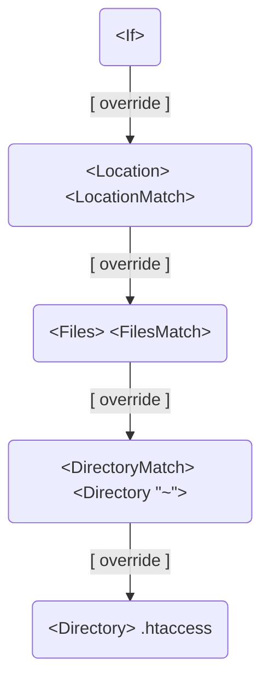

# Section

## Sections order

The order (priority / precedence) of merging is

- `<Directory>` and `.htaccess`
  - Shortest to longest
- `<DirectoryMatch>` and `<Directory "~">`
- `<Files>` and `<FilesMatch>`
  - In the order in the configuration
- `<Location>` and `<LocationMatch>`
  - In the order in the configuration
- `<If>`
  - in the order in the configuration

Sections having same priority are processed in the configuration file order.

> Ref: [How the sections are merged](https://httpd.apache.org/docs/2.4/sections.html#merging)
