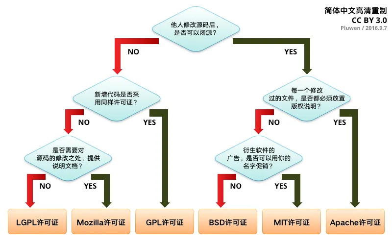

# License

- [MIT](MIT.md)
- [CC](CC.md)

> "[一分钟选择适合的开源许可证](https://medium.com/@pluwen/一分钟选择适合的开源许可证-98c8aa0f06c5)" by Pluwen / CC BY 3.0

## 免責條款

> THE SOFTWARE IS PROVIDED “AS IS”, WITHOUT WARRANTY OF ANY KIND, EXPRESS OR IMPLIED, INCLUDING BUT NOT LIMITED TO THE WARRANTIES OF MERCHANTABILITY, FITNESS FOR A PARTICULAR PURPOSE AND NONINFRINGEMENT. IN NO EVENT SHALL THE AUTHORS OR COPYRIGHT HOLDERS BE LIABLE FOR ANY CLAIM, DAMAGES OR OTHER LIABILITY, WHETHER IN AN ACTION OF CONTRACT, TORT OR OTHERWISE, ARISING FROM, OUT OF OR IN CONNECTION WITH THE SOFTWARE OR THE USE OR OTHER DEALINGS IN THE SOFTWARE.

意思是因使用軟件所造成的任何損害，都不可以對版權人士追究責任。

例如因軟件的 Bug，造成醫療設備發生問題，對病人造成的任何損害，都不可以對版權人士追究責任。
