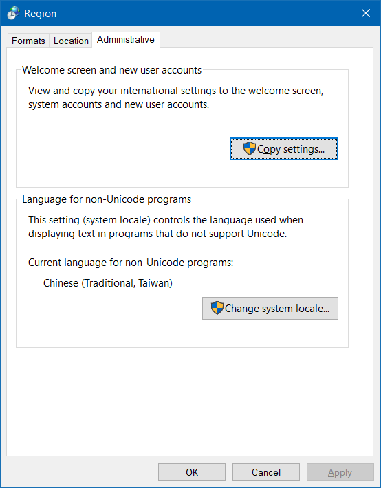

# Microsoft Office

## Change Office VBA display language

Change system locale

## Connect encrypted Access DB in Excel

`Access` > `File` > `Open` > `Open Exclusive`

`Access` > `File` > `Option` > `Client Settings` > `Use Legacy Encryption`

`Access` > `File` > `Info` > `Encrypt with Password`

## Word Memory Error

如果經常出現以下錯誤

可以關閉 `修正拼字及文法錯誤` 裡的所有選項

## Excel **傳送命令給程式時發生錯誤**

> [Ref](https://docs.microsoft.com/zh-tw/office/troubleshoot/excel/error-when-send-commands-in-excel)

- **檔案選項**
- **進階**
- 關閉 **忽略其他使用動態資料交換 (DDE) 的應用程式**

