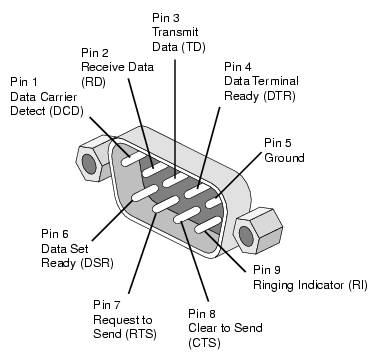

# SoC

System on a Chip

- Atmel (Microchip)
  - AVR
    - ATtiny85
      - DigiSpark
- STMicroelectronics
- Espressif
  - ESP8266 (WiFi)
    - ESP-01
    - ESP-02
    - ...
    - ESP-12
  - ESP8285 = ESP8266 + 1MiB Flash
  - ESP32 (WiFi + Bluetooth)

## Development board

### Arduino

- IDE: [Arduino](https://www.arduino.cc/), [PlatformIO](https://platformio.org/)

### STM

### Espressif

| | | |
|-|-|-|
| ESP8266 | WiFi | ESP-01 ~ ESP-12 |
| ESP32 | WiFi + Bluetooth |  |

- IDE: [Arduino](https://www.arduino.cc/), [PlatformIO](https://platformio.org/)
- PCB: [AI-Thinker](http://www.ai-thinker.com/)

### [Raspberry Pi](RaspberryPi.md)

- System: Linux

## USB to UART

- [WCH CH340](http://www.wch.cn/products/CH340.html)
  - *Popular*
  - UART
- [WCH CH341](http://www.wch.cn/products/CH341.html)
  - *Popular*
  - UART, I2C, SPI
- Prolific PL2303
  - Many fake
  - Fake version need [driver version 3.3.2.102](http://www.ifamilysoftware.com/Prolific_PL-2303_Code_10_Fix.html)
- Silicon CP2102
- FTDI232
  - Expensive

## Interface

- UART (Universal Asynchronous Receiver Transmitter)
  - [RS-232](https://en.wikipedia.org/wiki/RS-232) / Serial port
    - [DB-9](https://www.db9-pinout.com/)
      - DTE (male)
      - DCE (female)
    - DB-25
  - TTL (Transistor–Transistor Logic)
- SPI (Serial Peripheral Interface)
- I²C / I2C (Inter-Integrated Circuit)

### DB-9

Pin | SIG | Name | DTE (male)
-|-|-|-
1 | DCD | Data Carrier Detect | in
2 | RXD | Receive Data | in
3 | TXD | Transmit Data | out
4 | DTR | Data Terminal Ready | out
5 | GND | Signal Ground | -
6 | DSR | Data Set Ready | in
7 | RTS | Request To Send | out
8 | CTS | Clear To Send | in
9 | RI | Ring Indicator | in

### Common usage

`RXD TXD GND [RTS] [CTS]`

## IR (Infrared)

| Wave length | Command |
| - | - |
| 850 nm | Night vision |
| 940 nm | Remote control |
