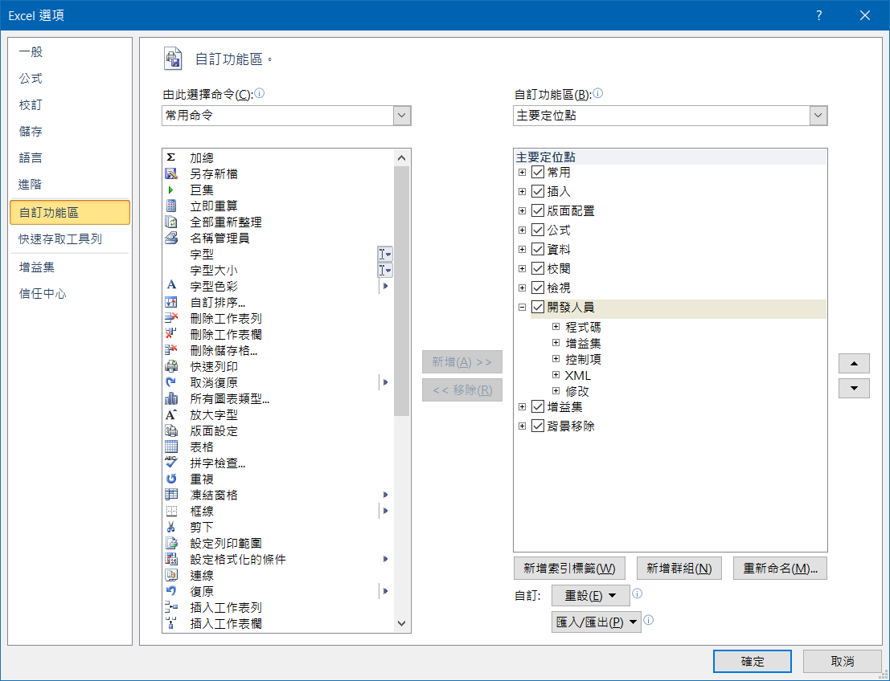
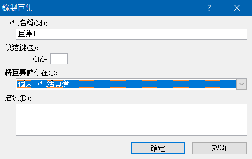

# 多個儲存格輸入

- 選取多個儲存格
- 輸入內容（可以是公式，會以參照位址填滿）
- <kbd>Ctrl</kbd> + <kbd>Enter</kbd>

# Enable "Developer" tab



# Personal Macro / Global Macro

[Reference](https://support.office.com/en-us/article/create-and-save-all-your-macros-in-a-single-workbook-66c97ab3-11c2-44db-b021-ae005a9bc790)

- Developer
  - Record Macro
- Store macro in
  - Personal Macro Workbook
- Developer
  - Stop Recording



Edit Personal Macro

- Developer
  - Visual Basic
    - VBA Project (PERSONAL.xlsb)


# Paste value

```vb
Sub PasteText()
    ' Paste:=xlPasteValues will cause 1004 error
    ' xlPasteAll only paste value, Bug?
    Selection.PasteSpecial Paste:=xlPasteAll
End Sub
```

# Note

- Global object is `Application` (like `window` in JavaScript)
