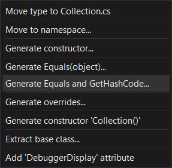

## .NET Core

- Cross-Platform
- Open Source
- High Performance

## .NET Framework

- Windows Only
- Not fully Open Source
- Deprecated ?

## Using in VS Code

- Install [.NET Core SDK](https://dotnet.microsoft.com/download)
- Install [C# extension](https://marketplace.visualstudio.com/items?itemName=ms-dotnettools.csharp)
- Run `dotnet new console` in project folder
  - Run `dotnet new --list` list all template
  - Press <kbd>F1</kbd> ▶ **.NET: Generate Assets for Build and Debug**
    - Press <kbd>F5</kbd> to run

## Main Class

> [Reference](https://docs.microsoft.com/en-us/dotnet/csharp/fundamentals/program-structure/main-command-line)

The `Main` method is the entry point of a C# application.

```cs
public class MainClass
{
    static void Main(string[] args)
    {
        Console.WriteLine("Hello World");
    }
}
```

If more than one class that has a `Main` method, use [`MainEntryPoint` or `StartupObject`](https://docs.microsoft.com/en-us/dotnet/csharp/language-reference/compiler-options/advanced#mainentrypoint-or-startupobject)

```xml
<PropertyGroup>
    <StartupObject>Namespace.Program</StartupObject>
</PropertyGroup>
```

Starting in C# 9, can be Top-Level

```cs
// Main.cs
Console.WriteLine("Hello World");
```

## Tools

[Mono Cecil](https://github.com/jbevain/cecil)

- Load existing managed assemblies, browse and inspect all the types, modify on the fly and save back the modified assembly.

[ILSpy](https://github.com/icsharpcode/ILSpy)

- .NET Decompiler

[dnSpy](https://github.com/dnSpy/dnSpy)

- .NET Debugger
- .NET Decompiler
- .NET Assembly editor

[BepInEx](https://github.com/BepInEx/BepInEx)

- For Unity
- Included HarmonyX

## Auto `using`

Auto `using` / import / include

Visual Studio 2019

- **Tools**
- **Options**
- **Text Editor**
- **C#**
- **IntelliSense**
- Enable **Show items from unimported namespaces**

VS Code

- Enable [**C# Extension**](https://marketplace.visualstudio.com/items?itemName=ms-dotnettools.csharp)
- **Setting**
  - **Extension**
  - **C# configuration**
  - Enable **Enable Import Completion**

## Enable `override`, `method` auto completion

VS Code

- Enable [**C# Extension**](https://marketplace.visualstudio.com/items?itemName=ms-dotnettools.csharp)
- **Setting**
  - **Extension**
  - **C# configuration**
  - **Enable Async Completion**

## `@` Variable

Use KeyWord as identifier

```cs
var @is = true;
```

## `var`

> [Ref](https://docs.microsoft.com/en-us/dotnet/csharp/language-reference/keywords/var)

Implicitly type

```cs
var i = 0;
// same as
int i = 0;

var f = 1.0f;
// same as
float f = 1.0f;
```

## `typeof` / `GetType()` / `is`

> [Reference](https://docs.microsoft.com/en-us/dotnet/csharp/language-reference/operators/type-testing-and-cast#cast-expression)

```cs
public class Animal { }

public class Cat : Animal { }

public static class TypeOfExample
{
    public static void Main()
    {
        object cat = new Cat();
        Console.WriteLine(cat is Animal);  // True
        Console.WriteLine(cat.GetType() == typeof(Animal));  // False

        Console.WriteLine(cat is Cat);  // True
        Console.WriteLine(cat.GetType() == typeof(Cat));  // True
    }
}
```

## `as` / Cast

> [Reference](https://docs.microsoft.com/en-us/dotnet/csharp/language-reference/operators/type-testing-and-cast#cast-expression)

```cs
// Cast, convert E to type T
(T) E

E as T
// same as
E is T ? (T)(E) : (T)null
```

- `E` is an expression that returns a value
- `T` is the name of a type or a type parameter

## String format

```cs
string.format("{0} is a {1}", "Cat", "animal");
// Cat is a animal

var a = "Cat";
var b = "animal";
$"{a} is a {b}";
// Cat is a animal
```

## Use `object` as `Dictionary` key

> [Reference](https://docs.microsoft.com/en-us/dotnet/csharp/programming-guide/statements-expressions-operators/how-to-define-value-equality-for-a-type)

```cs
public class DictKey
{
    public int key;

    public override int GetHashCode()
    {
        return this.key;
    }

    public override bool Equals(object obj)
    {
        return (obj is DictKey dictKey) &&
            return this.key == dictKey.key;
    }
}
```

Visual Studio has **Quick Action** to **Generate Equals and GetHashCode**

> [Reference](https://docs.microsoft.com/en-us/visualstudio/ide/reference/generate-equals-gethashcode-methods?view=vs-2019)



## Implement `GetHashCode()`

```cs
// .NET Core
HashCode.Combine(value, ...);
```

For Collection

```cs
public class Hash
{
    public List<int> list;

    public override int GetHashCode()
    {
        var hashCode = new HashCode();
        foreach (var item in list)
        {
            hashCode.Add(item);
        }
        return hashCode.ToHashCode();
    }
}
```

## `?.` / `?[]` Null-conditional operator

> [Reference](https://docs.microsoft.com/en-us/dotnet/csharp/language-reference/operators/member-access-operators#null-conditional-operators--and-)

```cs
a?.x
```

If a is null, the result is null, otherwise the result is a.x

```cs
a?.x()
a?.b?.c(d);
a?.b?[c];
```

If a is null, the result is null, and will not execute a.x(), otherwise the result is a.x()

> The null-conditional operators are short-circuiting. That is, if one operation in a chain of conditional member or element access operations returns null, the rest of the chain doesn't execute. 

```cs
a?[x]
```

If a is null, the result is null, otherwise the result is a[x]

## `byte[]` <-> `string`

`byte[]` to `string`

```cs
// .NET Framework
using System.Runtime.Remoting.Metadata.W3cXsd2001;

new SoapHexBinary(new byte[] { }).ToString();
```

Pure C# implement

```cs
public class Hex
{
    private static readonly char[][] lookup = CreateLookupTable();

    private static char[][] CreateLookupTable()
    {
        var table = new char[256][];
        for (int i = 0; i < table.Length; i++)
        {
            string s = i.ToString("X2");
            table[i] = new char[2] { s[0], s[1] };
        }
        return table;
    }

    public static string ToHex(byte[] bytes)
    {
        var result = new char[bytes.Length * 2];
        for (int i = 0; i < bytes.Length; i++)
        {
            var val = lookup[bytes[i]];
            result[2 * i] = val[0];
            result[2 * i + 1] = val[1];
        }
        return new string(result);
    }
}
```

`string` to `byte[]`

```cs
// .NET Framework
SoapHexBinary.Parse("00aabbEEFF").Value;
```

## Compute `string` hash

```cs
using System.Security.Cryptography;

public byte[] ComputeSHA1(string s)
{
    using (SHA1 sha1 = SHA1.Create())
    {
        return sha1.ComputeHash(
            Encoding.UTF8.GetBytes(s)
        );
    }
}
```

## Overflow Check

[Ref](https://docs.microsoft.com/en-us/dotnet/csharp/language-reference/language-specification/expressions#the-checked-and-unchecked-operators)

```cs
checked(/* expression */);
unchecked(/* expression */);

int i = int.MaxValue;
// Overflow, throw System.OverflowException()
i = checked(i + 1);

int i = int.MaxValue;
// i = int.MinValue
i = unchecked(i + 1);
```

## Event

> [Reference](https://docs.microsoft.com/en-us/dotnet/csharp/programming-guide/events/how-to-publish-events-that-conform-to-net-framework-guidelines)

## `using`

> [Reference](https://docs.microsoft.com/en-us/dotnet/csharp/language-reference/keywords/using-directive)

`using` static type

```cs
using static System.Console;

class Program
{
    static void Main()
    {
        WriteLine();
    }
}
```

`using` alias

```cs
using SysCon = System.Console;
using ListOfString = System.Collections.Generic.List<string>;
```

## Copy files after build

> [Reference](https://docs.microsoft.com/en-us/visualstudio/msbuild/msbuild-targets?view=vs-2019)

```xml
<Project ToolsVersion="15.0" xmlns="http://schemas.microsoft.com/developer/msbuild/2003">
  <Target Name="CopyFiles" AfterTargets="AfterBuild">
    <!-- Copy DLL/EXE to destination folder -->
    <Copy SourceFiles="$(TargetDir)$(TargetFileName)" DestinationFolder="<folder>" />
    <!-- <Copy SourceFiles="<file>[;<file>...]" DestinationFolder="<folder>" /> -->
  </Target>
</Project>
```

## Extension

```cs
namespace MathExtensionMethods
{
    public static class MathExtensions
    {
        public static double Power(this Double number, Double power)
        {
            return Math.Pow(number, power);
        }
    }
}

(2.0).Power(16)
```

## Single file app

> - [Single File deployment](https://docs.microsoft.com/en-us/dotnet/core/deploying/single-file)
> - [`dotnet publish`](https://docs.microsoft.com/en-us/dotnet/core/tools/dotnet-publish)

Single execute file

```xml title=".csproj"
<Project Sdk="Microsoft.NET.Sdk">

  <PropertyGroup>
    <OutputType>Exe</OutputType>
    <TargetFramework>net6.0</TargetFramework>
    <PublishSingleFile>true</PublishSingleFile>
    <SelfContained>true</SelfContained>
    <RuntimeIdentifier>win-x64</RuntimeIdentifier>
    <PublishReadyToRun>true</PublishReadyToRun>
  </PropertyGroup>

</Project>
```

| Option | CLI parameter | Description |
|-|-|-|
| `PublishSingleFile` |  | Publish single file |
| `SelfContained` | `--self-contained [true\|false]` | Contain .NET libraries and target runtime (&gt; 60MB) |
| `RuntimeIdentifier` | `-r\|--runtime` | Specifies the [OS and CPU type](https://docs.microsoft.com/en-us/dotnet/core/rid-catalog) (`win-x86`, `win-x64`, `win-arm`, `win-arm64`, ...)
| `PublishReadyToRun` |  | Enables ahead-of-time (AOT) compilation |

- Run `dotnet publish`
- VS Code ▶ **Run Task** ▶ **publish**

## Reference DLL

Add [Steamworks.NET](https://steamworks.github.io/installation/) reference

- Add to `.csproj`

```xml
<Project Sdk="Microsoft.NET.Sdk">
  <ItemGroup>
    <Reference Include="Steamworks.NET">
      <HintPath>Steamworks.NET.dll</HintPath>
      <SpecificVersion>False</SpecificVersion> 
      <!-- Copy DLL to Output folder -->
      <Private>True</Private>
    </Reference>
  </ItemGroup>
</Project>
```

- Copy `Steamworks.NET.dll` file to `root` folder
- Run `dotnet restore [<project.csproj>]`
- Run `dotnet run`

## Base Class

- C# will auto call base constructor
- Cannot have multiple base classes (Even abstract)

```cs
class BaseClass
{
    public BaseClass() { }
    public BaseClass(int i) { }
}

class ClassA : BaseClass
{
    // Specify base class constructor
    ClassA(int i) : base() {}
    // or
    ClassA(int i) : base(i) {}
}
```

## Serialize

### MessagePack

> [MessagePack](https://github.com/neuecc/MessagePack-CSharp)


## Attribute
