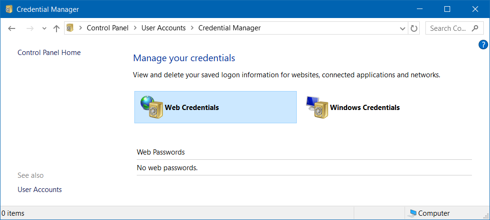

# Credential

## Credential Manager



## `cmdkey`

> [Doc](https://docs.microsoft.com/en-us/windows-server/administration/windows-commands/cmdkey)

## Add credential

```cmd
cmdkey /add:<target name> /user:<user name> /pass:<password>
```

## Delete credential

```cmd
cmdkey /delete:<target name>
```

## List credentials

```cmd
cmdkey /list
```
