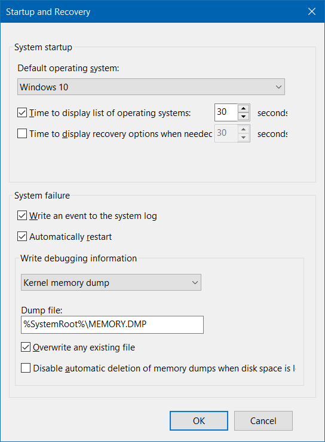

# Fix - Windows

Fix / Troubleshoot

## Get service of `svchost.exe`

- Right click `svchost.exe` process in Task Manager
- Click "Go to Service(s)"

## Windows Loader

Windows Loader does not work on UEFI

## BSOD (Blue Screen of Death) dump

[BlueScreenView](https://www.nirsoft.net/utils/blue_screen_view.html)



## Windows 7 update stuck at 35% after Disk Cleanup

> [Ref](https://www.thewindowsclub.com/software-distribution-folder-in-windows)

- Delete `%windir%\SoftwareDistribution\Download`

## TLS

TLS 1.1 / TLS 1.2

```
The request was aborted: Could not create SSL/TLS secure channel.
```

Enable TLS 1.1 and TLS 1.2 as default secure protocols in WinHTTP

```powershell title="Administrator PowerShell"
# 32-bit
sp "HKLM:\SOFTWARE\Microsoft\Windows\CurrentVersion\Internet Settings\WinHttp" -Name DefaultSecureProtocols -Value 0x00000A00 -Type DWord

# 64-bit
sp "HKLM:\SOFTWARE\Wow6432Node\Microsoft\Windows\CurrentVersion\Internet Settings\WinHttp" -Name DefaultSecureProtocols -Value 0x00000A00 -Type DWord
```

```powershell title="Administrator PowerShell"
ni "HKLM:\SYSTEM\CurrentControlSet\Control\SecurityProviders\SCHANNEL\Protocols\TLS 1.1\Client" -Force
sp "HKLM:\SYSTEM\CurrentControlSet\Control\SecurityProviders\SCHANNEL\Protocols\TLS 1.1\Client" -Name DisabledByDefault -Value 0 -Type DWord

ni "HKLM:\SYSTEM\CurrentControlSet\Control\SecurityProviders\SCHANNEL\Protocols\TLS 1.2\Client" -Force
sp "HKLM:\SYSTEM\CurrentControlSet\Control\SecurityProviders\SCHANNEL\Protocols\TLS 1.2\Client" -Name DisabledByDefault -Value 0 -Type DWord
```

:::note Reference

[Update to enable TLS 1.1 and TLS 1.2 as default secure protocols in WinHTTP in Windows](https://support.microsoft.com/en-US/topic/update-to-enable-tls-1-1-and-tls-1-2-as-default-secure-protocols-in-winhttp-in-windows-c4bd73d2-31d7-761e-0178-11268bb10392)

:::

```
sp "HKLM:\SOFTWARE\Microsoft\.NETFramework\v2.0.50727" -Name SystemDefaultTlsVersions -Value 1 -Type DWord
```

:::note Reference

[Support for TLS System Default Versions included in the .NET Framework 3.5.1](https://support.microsoft.com/en-us/topic/support-for-tls-system-default-versions-included-in-the-net-framework-3-5-1-on-windows-7-sp1-and-server-2008-r2-sp1-5ef38dda-8e6c-65dc-c395-62d2df58715a)

:::
