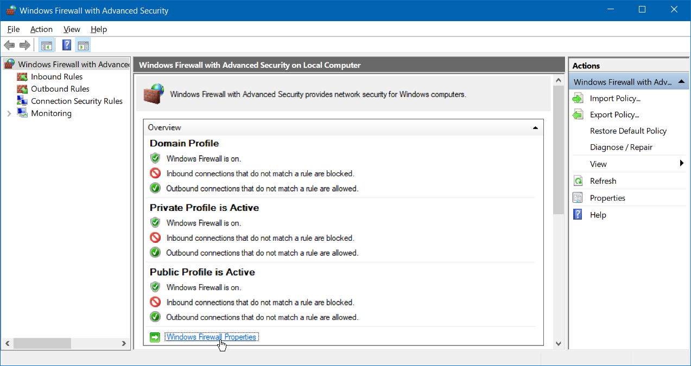

# Network - Windows

## Firewall

### Change default to block



:::note Reference

[How to Create Advanced Firewall Rules in the Windows Firewall](https://www.howtogeek.com/112564/how-to-create-advanced-firewall-rules-in-the-windows-firewall/)

:::

## Network Profile

[PowerShell](PowerShell/Network.md#network-profile)

## IP address conflict

Windows will use IP `169.254.0.0/16` if IP address conflict

## Network monitor

- [TCPView](https://docs.microsoft.com/en-us/sysinternals/downloads/tcpview)
- [WireShark](https://www.wireshark.org/)
- [WinDump](https://www.winpcap.org/windump/)

## Network emulator

Delay / Drop / Bandwidth ...

- [clumsy](https://github.com/jagt/clumsy)
- [WinDivert](https://github.com/basil00/Divert)

## Show TCP / UDP connection

[PowerShell](PowerShell/Network.md#show-tcp-listening-port)

```cmd
netstat <option>
```

| Option | Permission |
| - | - |
| `-a` | Displays all connections and listening ports |
| `-n` | Displays addresses and port numbers in numerical form |

## Reset (Repair) TCP/IP stack

```cmd
netsh winsock reset
netsh int[erface] ip[v4] reset
netsh int[erface] ipv6 reset
ipconfig /flushdns
```

:::note Reference

- [How to reset TCP/IP by using the NetShell utility](https://support.microsoft.com/en-us/help/299357/how-to-reset-tcp-ip-by-using-the-netshell-utility)
- [Network troubleshooting](https://support.microsoft.com/en-us/help/10741/windows-fix-network-connection-issues)

:::

## TCP/IP time-out

TCP/IP re-transmission time-out

Get

```cmd
netsh interface tcp show global
```

Set

```cmd
netsh interface tcp set global initialrto=<ms>
```

:::note Reference

- [You cannot customize some TCP configurations by using the netsh command](https://support.microsoft.com/en-us/topic/you-cannot-customize-some-tcp-configurations-by-using-the-netsh-command-in-windows-server-2008-r2-c1feebea-82a8-cb05-83c7-46ffb5fd9cec)
- [How to modify the TCP/IP maximum retransmission time-out](https://support.microsoft.com/en-us/topic/how-to-modify-the-tcp-ip-maximum-retransmission-time-out-7ae0982a-4963-fa7e-ee79-ff6d0da73db8)

:::
