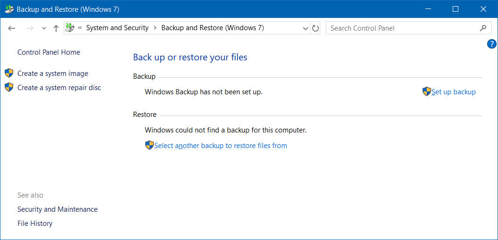
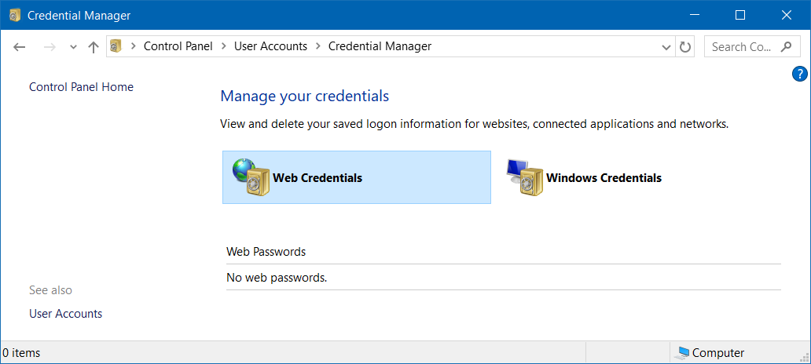
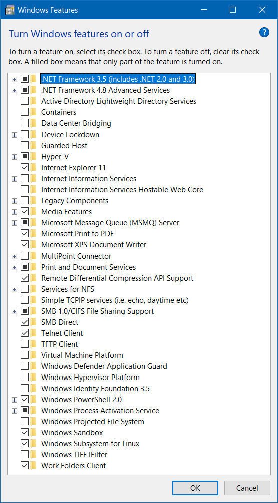

## Table of Contents
- [Table of Contents](#table-of-contents)
- [Recovery](#recovery)
  - [WinRE (Windows Recovery Environment)](#winre-windows-recovery-environment)
  - [System image](#system-image)
- [Control panel](#control-panel)
- [Startup](#startup)
  - [User Startup folder](#user-startup-folder)
  - [All Users Startup folder](#all-users-startup-folder)
- [User](#user)
  - [User Account Management / Auto Login](#user-account-management--auto-login)
  - [Computer Management / Local User](#computer-management--local-user)
  - [Create User](#create-user)
  - [Delete User](#delete-user)
  - [Make password never expire](#make-password-never-expire)
- [Group Policy](#group-policy)
- [Credential Manager](#credential-manager)
- [Remote Desktop](#remote-desktop)
- [Hibernate](#hibernate)
- [`.cab` file](#cab-file)
- [File Permission (ACL)](#file-permission-acl)
  - [`calcs`](#calcs)
  - [`icacls`](#icacls)
- [Registry](#registry)
  - [Registry CLI](#registry-cli)
- [Cortana](#cortana)
- [Allow input unicode with <kbd>Alt</kbd> + <kbd>+\<Code\></kbd>](#allow-input-unicode-with-kbdaltkbd--kbdcodekbd)
- [Enable / Disable the Local Built-In Administrator Account](#enable--disable-the-local-built-in-administrator-account)
- [Get OS Architecture (32-bit / 64-bit)](#get-os-architecture-32-bit--64-bit)
- [SLP (System Locked Pre-installation) / SLIC (System License Internal Code)](#slp-system-locked-pre-installation--slic-system-license-internal-code)
- [Code page](#code-page)
- [Cleanup](#cleanup)
  - [Cleanup WinSxS](#cleanup-winsxs)
  - [Cleanup hibernate](#cleanup-hibernatehibernate)
- [Disable USB storage](#disable-usb-storage)
- [Windows Features](#windows-features)
  - [Install Windows Sandbox](#install-windows-sandbox)
- [Virtual switch](#virtual-switch)

## Recovery

### WinRE (Windows Recovery Environment)

- [Reference](https://support.microsoft.com/en-us/help/12415)

<kbd>Shift</kbd> + Restart

### System image

Use to backup / restore OS



## Control panel

- Input `control panel` in `Start` search
- Run `control`

## Startup

- [Reference](https://support.microsoft.com/en-us/help/4026268/windows-10-change-startup-apps)

### User Startup folder

Open in `Run` or Explorer

```
shell:startup
```

Open in command

```cmd
start shell:startup
```

### All Users Startup folder

Open in `Run` or Explorer

```
shell:common startup
```

Open in PowerShell

```powershell
start "shell:common startup"
```

## User

### User Account Management / Auto Login

```cmd
netplwiz.exe
```

### Computer Management / Local User
```cmd
lusrmgr.msc
```

### Create User

```cmd
net user <user name> [<password>] /add
```

```powershell
# PowerShell
New-LocalUser <user name> [-Password (Read-Host -AsSecureString) | -NoPassword]
```

### Delete User

```cmd
net user <user name> /delete
```

```powershell
# PowerShell
Remove-LocalUser <user name>
```

### Make password never expire

```cmd
wmic UserAccount [where Name=<user name>] set PasswordExpires={True|False}
```

Using group policy

`Computer Configuration` > `Windows Settings` > `Security Settings` > `Password Policy` > `Maximum password age` > Set to `0`

## Group Policy

```cmd
gpedit.msc
```

## Credential Manager



- [Reference](https://docs.microsoft.com/en-us/windows-server/administration/windows-commands/cmdkey)

Add credential
```cmd
cmdkey /add:<target name> /user:<user name> /pass:<password>
```

Delete credential
```cmd
cmdkey /delete:<target name>
```

List credentials
```cmd
cmdkey /list
```

## Remote Desktop

| Description | Command |
| - | - |
| Connect to remote | `mstsc [/v:<host>[:<port>]]` |
| Toggle full screen | <kbd>Ctrl</kbd> + <kbd>Alt</kbd> + <kbd>Break</kbd> |
| List remote desktop session | `query session` |
| Attach remote desktop session to console | `tscon <session ID> /dest:console` |

## Hibernate

> [Reference](https://support.microsoft.com/en-us/help/920730/how-to-disable-and-re-enable-hibernation-on-a-computer-that-is-running), [Reference](https://docs.microsoft.com/en-us/windows-hardware/design/device-experiences/powercfg-command-line-options)

Enable / Disable hibernate (remove `hiberfil.sys` file)

```
powercfg { /hibernate | /h } [ on | off ]
powercfg { /hibernate | /h } /size <percent size>
powercfg { /hibernate | /h } /type { reduced | full }
```

## `.cab` file

Extract `.cab`
```cmd
expand <file.cab>
```

Create `.cab`
```cmd
makecab <file> <file.cab>
```

## File Permission (ACL)

### `calcs`

> [Reference](http://technet.microsoft.com/en-us/library/bb490872.aspx)

| Option | Permission |
| - | - |
| `n` | None |
| `r` | Read |
| `w` | Write |
| `c` | Change (Write) |
| `f` | Full Control |

Replace permission
```cmd
cacls <file> /p <user>:<permission>
```

Edit permission
```cmd
cacls <file> /e /p <user>:<permission>
```

Change owner
```cmd
cacls <file> /r <user>
```

### `icacls`

> [Reference](https://docs.microsoft.com/en-us/windows-server/administration/windows-commands/icacls)

```cmd
icacls <file> <option>
```

| Option | Description |
| - | - |
| `/t` | Traverse subdirectories |
| `/c` | Continue on file error |
| `/l` | Performs on a symbolic link, not its destination |
| `/setowner <user>` | Changes the owner |
| `/reset` | Replaces with default inherited ACLs |
| `/grant[:r] <user>:<permissions>` | Grants specified user access rights<br/> `:r` means replace previously granted explicit permissions |
| `/deny <user>:<permissions>` | Denies specified user access rights |
| `/remove[:g\|:d] <user>` | Remove access rights of specified user from DACL<br/>`:g` = Grant<br/>`:d` = Deny |

Permission syntax

```
[(OI)][(CI)][(IO)][(NP)][<simple permission>[...]](<permission>[,...])
```

Permission

| Inherit | Description |
| - | - |
| `(OI)` | Object Inherit |
| `(CI)` | Container inherit |
| `(IO)` | Inherit only |
| `(NP)` | Do not propagate inherit |

| Simple permission | Description |
| - | - |
| `F` | Full access |
| `M` | modify access |
| `RX` | Read and execute access|
| `R` | Read-only access |
| `W` | Write-only access |

| Permission | Description |
| - | - |
| `D` | Delete |
| `RC` | Read control |
| `WDAC` | Write DAC |
| `WO` | Write owner |
| `S` | Synchronize |
| `AS` | Access system security |
| `MA` | Maximum allowed |
| `GR` | Generic read |
| `GW` | Generic write |
| `GE` | Generic execute |
| `GA` | Generic all |
| `RD` | Read data/list directory |
| `WD` | Write data/add file |
| `AD` | Append data/add subdirectory |
| `REA` | Read extended attributes |
| `WEA` | Write extended attributes |
| `X` | Execute/traverse |
| `DC` | Delete child |
| `RA` | Read attributes |
| `WA` | Write attributes |

## Registry

Registry file location

- [Reference](http://msdn.microsoft.com/en-us/library/ms724877%28v=vs.85%29.aspx)

| Registry hive | Supporting files |
| - | - |
| `HKEY_CURRENT_CONFIG` | System, System.alt, System.log, System.sav |
| `HKEY_CURRENT_USER` | Ntuser.dat, Ntuser.dat.log |
| `HKEY_LOCAL_MACHINE\SAM` | Sam, Sam.log, Sam.sav |
| `HKEY_LOCAL_MACHINE\Security` | Security, Security.log, Security.sav |
| `HKEY_LOCAL_MACHINE\Software` | Software, Software.log, Software.sav |
| `HKEY_LOCAL_MACHINE\System` | System, System.alt, System.log, System.sav |
| `HKEY_USERS\.DEFAULT` | Default, Default.log, Default.sav |

Edit registry file
- Execute `regedit`
- Select the `HKEY_LOCAL_MACHINE` root key
- Menu `File` > `Load Hive...`
- Choose the DAT file for the registry you wish to edit
- You will be prompted for a name to load the hive into. The name does not matter. It just loads the registry hive into a subfolder using the name you provide
- You can then edit the registry you just loaded in the same manner as any other registry. All changes are made in real time, just as normal
- When you're done, go to the menu `File` > `Unload Hive...`

### Registry CLI

```cmd
reg add
    {HKLM|HKCU|HKCR|HKU|HKCC}\<key>
    { /ve | /v <value name> }
    /t { REG_SZ | REG_MULTI_SZ | REG_EXPAND_SZ | REG_DWORD | REG_QWORD | REG_BINARY | REG_NONE }
    /d <value>
```

```cmd
reg query
    {HKLM|HKCU|HKCR|HKU|HKCC}\<key>
    [<option> ...]
```

| Option | Description |
| - | - |
| `/ve ` | Query default value |
| `/v <value name>` | Query specific value name |
| `/t { REG_SZ \| REG_MULTI_SZ \| REG_EXPAND_SZ \| REG_DWORD \| REG_QWORD \| REG_BINARY \| REG_NONE }` | Query specific data type |
| `/f <data>` | Search specific data |

## Cortana

Disable Cortana in Windows 10
```cmd
reg add "HKLM\SOFTWARE\Policies\Microsoft\Windows\Windows Search" /v "AllowCortana" /t REG_DWORD /d 0 /f
```

```powershell
## PowerShell
New-ItemProperty -Path "HKLM:\SOFTWARE\Policies\Microsoft\Windows\Windows Search" -Name "AllowCortana" -PropertyType DWord -Value 0 -Force
```

Enable Cortana in Windows 10
```cmd
reg delete "HKLM\SOFTWARE\Policies\Microsoft\Windows\Windows Search" /v "AllowCortana" /f
```

```powershell
## PowerShell
Remove-ItemProperty -Path "HKLM:\SOFTWARE\Policies\Microsoft\Windows\Windows Search" -Name "AllowCortana"
```

## Allow input unicode with <kbd>Alt</kbd> + <kbd>+\<Code\></kbd>

- [Reference](http://www.fileformat.info/tip/microsoft/enter_unicode.htm)
```cmd
reg add "HKCU\Control Panel\Input Method" /v "EnableHexNumpad" /t REG_SZ /d 1 /f
```

## Enable / Disable the Local Built-In Administrator Account

- [Reference](https://social.technet.microsoft.com/wiki/contents/articles/3040.windows-7-enable-disable-the-local-built-in-administrator-account.aspx)
```
net user administrator /active:{yes|no}
```

## Get OS Architecture (32-bit / 64-bit)

- [Reference](https://www.lisenet.com/2014/get-windows-system-information-via-wmi-command-line-wmic/)
```cmd
wmic OS get OSArchitecture
```

```powershell
## PowerShell
(Get-CimInstance Win32_OperatingSystem).OSArchitecture
```

## SLP (System Locked Pre-installation) / SLIC (System License Internal Code)

Install license

```cmd
slmgr.vbs -ilc <path>
```

Install product key

```cmd
slmgr.vbs -ipk <product key>
```

## Code page

- [Reference](https://docs.microsoft.com/en-us/windows-server/administration/windows-commands/chcp)

```cmd
chcp <code page>
```

Change active code page to UTF-8
```cmd
chcp 65001
```

## Cleanup

### Cleanup WinSxS

- [Reference](https://docs.microsoft.com/en-us/windows-hardware/manufacture/desktop/clean-up-the-winsxs-folder)

```cmd
Dism.exe /online /Cleanup-Image /StartComponentCleanup /ResetBase
Dism.exe /online /Cleanup-Image /SPSuperseded
```

### [Cleanup hibernate](#hibernate)

## Disable USB storage

[Reference](https://support.microsoft.com/en-ie/help/823732/how-can-i-prevent-users-from-connecting-to-a-usb-storage-device)

```powershell
Set-ItemProperty -Path HKLM:\SYSTEM\CurrentControlSet\Services\USBSTOR\ -Name Start -Value 4
```

Enable USB storage

```powershell
Set-ItemProperty -Path HKLM:\SYSTEM\CurrentControlSet\Services\USBSTOR\ -Name Start -Value 3
```

## Windows Features

```powershell
& ([System.Environment]::SystemDirectory + "\OptionalFeatures.exe")
```



### Install Windows Sandbox

Use [Windows Features](#windows-features)

or

```powershell
Enable-WindowsOptionalFeature -Online -All -FeatureName Containers-DisposableClientVM
```

## Virtual switch

Install Hyper-V and virtual switch

```powershell
Enable-WindowsOptionalFeature -Online -All -FeatureName Microsoft-Hyper-V
```

Disable Hyper-V without uninstallation

[Reference](https://docs.microsoft.com/en-us/windows-hardware/drivers/devtest/bcdedit--set)

```cmd
bcdedit /set hypervisorlaunchtype { off | auto }
```

Get current setting

```cmd
bcdedit /enum "{current}"
```
