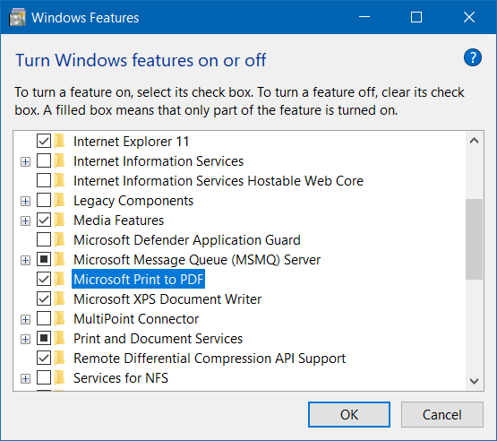

# Windows

## Recovery

### WinRE (Windows Recovery Environment)

- [Reference](https://support.microsoft.com/en-us/help/12415)

<kbd>Shift</kbd> + Restart

### System image

Use to backup / restore OS


## Control panel

- Input `control panel` in `Start` search
- Run `control`

## Startup

- [Reference](https://support.microsoft.com/en-us/help/4026268/windows-10-change-startup-apps)

### User Startup folder

Open in `Run` or Explorer

```
shell:startup
```

Open in command

```cmd
start shell:startup
```

### All Users Startup folder

Open in `Run` or Explorer

```
shell:common startup
```

Open in PowerShell

```powershell
start "shell:common startup"
```

## User

### User Account Management / Auto Login

```cmd
netplwiz.exe
```

### Computer Management / Local User
```cmd
lusrmgr.msc
```

### Create User

```cmd
net user <user name> [<password>] /add
```

```powershell
# PowerShell
New-LocalUser <user name> [-Password (Read-Host -AsSecureString) | -NoPassword]
```

### Delete User

```cmd
net user <user name> /delete
```

```powershell
# PowerShell
Remove-LocalUser <user name>
```

### Make password never expire

```cmd
wmic UserAccount [where Name=<user name>] set PasswordExpires={True|False}
```

Using group policy

`Computer Configuration` > `Windows Settings` > `Security Settings` > `Password Policy` > `Maximum password age` > Set to `0`

## Group Policy

```cmd
gpedit.msc
```

## Remote Desktop

| Description | Command |
| - | - |
| Connect to remote | `mstsc [/v:<host>[:<port>]]` |
| Toggle full screen | <kbd>Ctrl</kbd> + <kbd>Alt</kbd> + <kbd>Break</kbd> |
| List remote desktop session | `query session` |
| Attach remote desktop session to console (Screen) | `tscon <session ID> /dest:console` |

## Hibernate

> [Reference](https://support.microsoft.com/en-us/help/920730/how-to-disable-and-re-enable-hibernation-on-a-computer-that-is-running), [Reference](https://docs.microsoft.com/en-us/windows-hardware/design/device-experiences/powercfg-command-line-options)

Enable / Disable hibernate (remove `hiberfil.sys` file)

```
powercfg { /hibernate | /h } [ on | off ]
powercfg { /hibernate | /h } /size <percent size>
powercfg { /hibernate | /h } /type { reduced | full }
```

## `.cab` file

Extract `.cab`

```cmd
expand <file.cab>
```

Create `.cab`

```cmd
makecab <file> <file.cab>
```

## Cortana

Disable Cortana in Windows 10

```cmd
reg add "HKLM\SOFTWARE\Policies\Microsoft\Windows\Windows Search" /v "AllowCortana" /t REG_DWORD /d 0 /f
```

```powershell
## PowerShell
New-ItemProperty -Path "HKLM:\SOFTWARE\Policies\Microsoft\Windows\Windows Search" -Name "AllowCortana" -PropertyType DWord -Value 0 -Force
```

Enable Cortana in Windows 10

```cmd
reg delete "HKLM\SOFTWARE\Policies\Microsoft\Windows\Windows Search" /v "AllowCortana" /f
```

```powershell
## PowerShell
Remove-ItemProperty -Path "HKLM:\SOFTWARE\Policies\Microsoft\Windows\Windows Search" -Name "AllowCortana"
```

## Allow input unicode with <kbd>Alt</kbd> + <kbd>+\<Code\></kbd>

- [Reference](http://www.fileformat.info/tip/microsoft/enter_unicode.htm)
```cmd
reg add "HKCU\Control Panel\Input Method" /v "EnableHexNumpad" /t REG_SZ /d 1 /f
```

## Enable / Disable the Local Built-In Administrator Account

- [Reference](https://social.technet.microsoft.com/wiki/contents/articles/3040.windows-7-enable-disable-the-local-built-in-administrator-account.aspx)

```cmd
net user administrator /active:{yes|no}
```

## Get OS Architecture (32-bit / 64-bit)

- [Reference](https://www.lisenet.com/2014/get-windows-system-information-via-wmi-command-line-wmic/)

```cmd
wmic OS get OSArchitecture
```

```powershell
## PowerShell
(Get-CimInstance Win32_OperatingSystem).OSArchitecture
```

## SLP (System Locked Pre-installation) / SLIC (System License Internal Code)

Install license

```cmd
slmgr.vbs -ilc <path>
```

Install product key

```cmd
slmgr.vbs -ipk <product key>
```

## Code page

- [Reference](https://docs.microsoft.com/en-us/windows-server/administration/windows-commands/chcp)

```cmd
chcp <code page>
```

Change active code page to UTF-8
```cmd
chcp 65001
```

## Cleanup

### Cleanup WinSxS

- [Reference](https://docs.microsoft.com/en-us/windows-hardware/manufacture/desktop/clean-up-the-winsxs-folder)

```cmd
Dism.exe /online /Cleanup-Image /StartComponentCleanup /ResetBase
Dism.exe /online /Cleanup-Image /SPSuperseded
```

### [Cleanup hibernate](#hibernate)

## Disable USB storage

[Reference](https://support.microsoft.com/en-ie/help/823732/how-can-i-prevent-users-from-connecting-to-a-usb-storage-device)

```powershell
Set-ItemProperty -Path HKLM:\SYSTEM\CurrentControlSet\Services\USBSTOR\ -Name Start -Value 4
```

Enable USB storage

```powershell
Set-ItemProperty -Path HKLM:\SYSTEM\CurrentControlSet\Services\USBSTOR\ -Name Start -Value 3
```

## Windows Features

```powershell
& ([System.Environment]::SystemDirectory + "\OptionalFeatures.exe")
```


### Install Windows Sandbox

Use [Windows Features](#windows-features)

or

```powershell
Enable-WindowsOptionalFeature -Online -All -FeatureName Containers-DisposableClientVM
```

## Windows 11 Processor Requirements

> [Reference](https://docs.microsoft.com/en-us/windows-hardware/design/minimum/windows-processor-requirements)

- [Supported Intel Processors](https://docs.microsoft.com/en-us/windows-hardware/design/minimum/supported/windows-11-supported-intel-processors)
- [Supported AMD Processors](https://docs.microsoft.com/en-us/windows-hardware/design/minimum/supported/windows-11-supported-amd-processors)

## "Print to PDF" printer

For Windows 10



